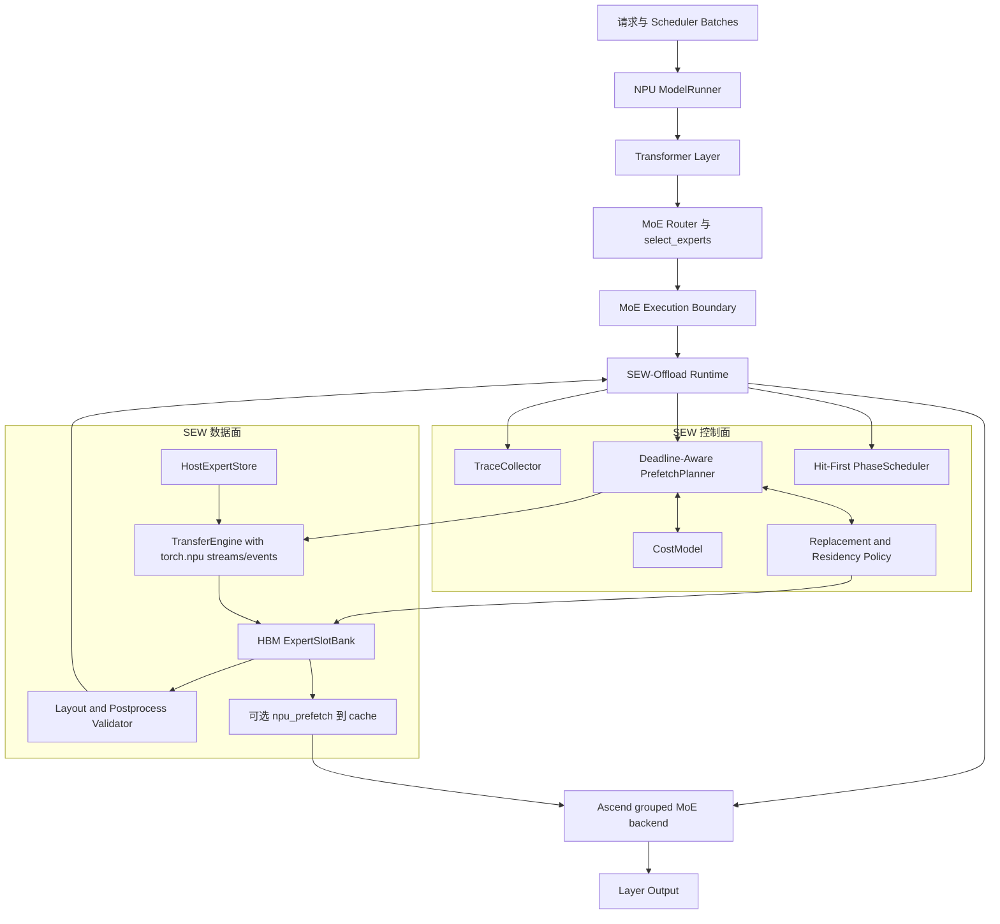
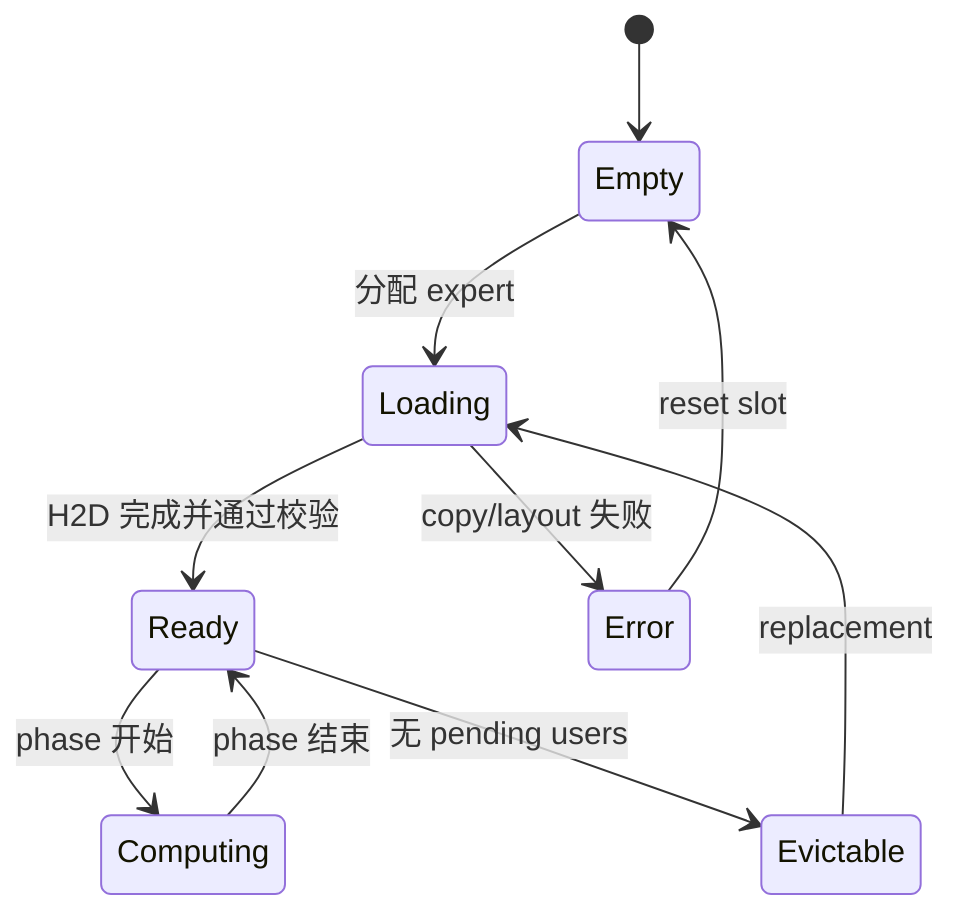
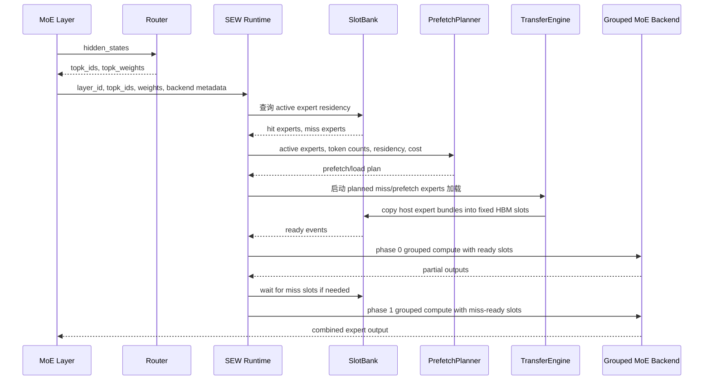
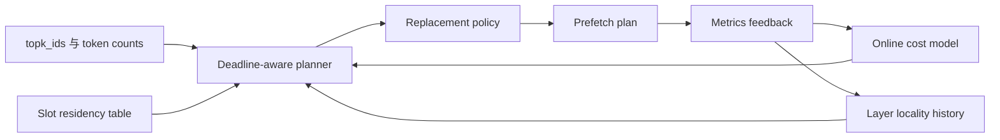
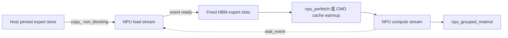

# Ascend MoE Offloading 系统架构

## 1. 核实结论

当前 `vllm-hust` 与 `vllm-ascend-hust` 组合还不能提供可工作的
Ascend NPU MoE expert offloading 推理服务。

需要区分三件事：

- vLLM-HUST 已有通用模型权重 offloading 后端：`uva` 和
  layer/parameter 级 `prefetch`。
- vLLM-Ascend-HUST 已有较成熟的 Ascend MoE 执行组件：routing、
  per-expert token grouping、grouped matmul、expert parallelism、EPLB、
  graph execution、weight prefetch 和 KV offload。
- 当前栈还没有 Ascend-specific MoE expert working-set offload runtime。
  也就是说，系统还不能根据本轮 routed experts，把 CPU/host 侧 expert
  权重加载到稳定的 NPU-resident slots，再交给 `npu_grouped_matmul`
  安全执行。

因此，这个问题是真实存在的，不是少开了某个命令行参数。

## 2. 证据链

这个结论已经用本地代码、本地 Qwen3-30B-A3B 实测 artifact，以及当前官方文档交叉核实：

- vLLM `OffloadConfig` 文档暴露的模型权重 offload 方式是 `auto`、
  `uva` 和 `prefetch`；其中 `prefetch` 是 group-based layer offloading。
- vLLM Ascend KV Cache CPU Offload 文档描述了 Ascend-specific
  `NPUOffloadingSpec`，但它面向 KV cache blocks，不是模型 expert 权重。
- vLLM Ascend Weight Prefetch 文档描述的是利用 vector-computation
  窗口把权重预取到 cache/L2；它不是 host-to-HBM expert weight offloading。

参考：

- `https://docs.vllm.ai/en/latest/api/vllm/config/offload/`
- `https://docs.vllm.ai/projects/ascend/en/main/user_guide/feature_guide/kv_cache_cpu_offload.html`
- `https://docs.vllm.ai/projects/ascend/en/main/user_guide/feature_guide/weight_prefetch.html`

### 2.1 vLLM-HUST 通用 Weight Offloading 不感知 Expert Working Set

`vllm/config/offload.py` 只定义了三类 backend：

```text
auto, uva, prefetch
```

`prefetch` 配置是按 layer group 工作的：

```text
offload_group_size
offload_num_in_group
offload_prefetch_step
offload_params
```

它按静态 module 顺序选择层或命名参数，不使用当前 MoE 层的
`topk_ids`、per-expert token counts、expert cache hit、slot miss，或
deadline-aware expert loading。

`vllm/model_executor/offloader/prefetch.py` 的实现会根据参数名、shape、
stride 和 dtype 分配 static buffer pool，然后通过 module forward hook
插入 `wait_prefetch` 与 `start_prefetch`。这对通用 layer-level weight
offloading 有用，但它不是 MoE expert working-set offloading 所需的抽象。

### 2.2 现有 Offload Path 仍是 CUDA-Shaped

`PrefetchOffloader` 使用：

```text
torch.cuda.Stream
torch.cuda.Event
torch.cuda.current_stream()
torch.cuda.is_current_stream_capturing()
torch.cuda.stream(...)
```

这些接口中的一部分可以被 vLLM Ascend 的 CUDA-to-NPU compatibility layer
包装，但 offload 抽象本身仍然是 CUDA graph 与 CUDA stream 形状。生产级
Ascend MoE offload service 应该直接使用 `torch.npu` streams/events，并在
Ascend MoE execution boundary 做明确同步。

### 2.3 UVA Offload 不支持 NPU

`UVAOffloader` 依赖：

```text
get_accelerator_view_from_cpu_tensor(cpu_data)
```

本地 Qwen3-30B-A3B 实测失败为：

```text
ValueError: `get_accelerator_view_from_cpu_tensor` is currently not supported in: npu
```

因此，`uva` 不能作为 Ascend MoE offload baseline。

### 2.4 Prefetch 可以节省 HBM，但会在生成前失败

在单张 Ascend 910B3 上，Qwen3-30B-A3B no-offload 可以成功：

```text
Loading model weights took 56.9001 GB
output throughput 7.6207 tok/s
TTFT 465.78 ms
TPOT 128.59 ms
```

expert-only native prefetch 达到了预期的显存节省：

```text
Loading model weights took 43.4001 GB
```

但它在生成请求前失败：

```text
RuntimeError: Expected all tensors to be on the same device, but got weight is
on cpu, different from other tensors on npu:0 ... wrapper__npu_grouped_matmul
```

all-parameter native prefetch 同样降低了 resident weight：

```text
Loading model weights took 42.9722 GB
```

但它在 dense matmul 路径中出现 CPU/NPU tensor mixing，并伴随 Ascend runtime
报错：vector core execution abnormal 和 MTE DDR address out-of-range。

这同时证明了两点：

1. 省 HBM 的动机是真实的。
2. 当前通用 offload 抽象对 Ascend MoE 执行来说不安全，也不充分。

### 2.5 vLLM-Ascend 有 Prefetch，但它是 HBM/Cache Prefetch

`docs/source/user_guide/feature_guide/weight_prefetch.md` 描述的 Ascend
weight prefetch pipeline，是在 linear computation 之前，把已经 device-resident
的权重预加载到 cache 中。它利用 MoE gating top-k、RMSNorm、SwiGLU 等
vector computation 窗口隐藏 CMO prefetch 开销。

这个特性有价值，但它不是 host-to-HBM expert offloading。它没有 host expert
store、fixed expert slots、expert miss handling，也没有 expert replacement
policy。

## 3. 问题定义

现有 MoE serving 系统通常把 expert weights 视为动态 cached device objects。
系统决定哪些 experts 应留在 device memory 中，并通过 replacement、prediction
和 copy/compute overlap 降低传输成本。

这个抽象在 Ascend NPU 上是不完整的。Ascend MoE execution 依赖或受益于稳定的
tensor 地址、固定 execution windows、layout-stable weights、ACLGraph/NPUGraph
replay、显式 stream/event synchronization，以及 MTE/Cube-friendly data layout。
如果 miss experts 以 CPU tensors 或任意新分配的 device tensors 暴露给执行路径，
`npu_grouped_matmul` 要么直接失败，要么失去高性能执行所需的静态结构。

因此，系统问题应定义为：

```text
将动态 routed expert working set 映射到稳定、layout-compatible 的
NPU-resident expert slots，并调度 host-to-HBM loading 与 grouped MoE execution，
使暴露在关键路径上的 miss stall 最小化。
```

优化目标是：

```text
exposed_stall = max(0, expert_load_time - overlap_time)
```

而不是单纯的 cache hit rate。

## 4. 系统目标

拟议框架 SEW-Offload 应满足以下目标：

1. 保持模型语义不变：不重训练 router、不改变 top-k、不 drop expert、不用近似 expert 替代。
2. 让 Ascend compute 始终看到 NPU-resident、post-processed、layout-compatible 的 expert weights。
3. 保持 slot tensor 地址稳定，使其适配 graph/static-kernel 友好的执行方式。
4. 使用 routed expert IDs 和 per-expert token counts 驱动 prefetch、replacement 与 phase scheduling。
5. 利用 routing、dispatch、resident expert compute、前后层窗口和 decode-step locality 隐藏 host-to-HBM expert loading。
6. 保持低侵入集成，并默认关闭。

## 5. 非目标

第一阶段实现不应做这些事：

- 修改 router logits 或 routing algorithm。
- drop tokens 或 experts。
- 从头重写已有 Ascend token dispatch/grouped matmul。
- 依赖 UVA。
- 调通用 layer-level offload policy，然后把它称为 MoE offloading。
- 一开始就修改 scheduler 或 model runner 主路径。
- 默认引入 per-expert tiny kernels 或 per-miss graph fragments。

## 6. 当前 MoE Execution Boundary

最低风险的集成点在 `AscendUnquantizedFusedMoEMethod.apply()` 内部：

```text
select_experts(...)
  -> topk_ids, topk_weights
  -> build_fused_experts_input(...)
  -> moe_comm_method.fused_experts(...)
```

在这个 boundary，runtime 能看到：

- `topk_ids`
- `topk_weights`
- layer id
- expert map
- quantization mode
- communication mode
- `w13_weight` / `w2_weight`
- 最终 grouped MoE backend call

SEW-Offload 应在这里检查 expert residency、准备 slot-backed weights，并在后续阶段可选地把执行拆成 phases。

## 7. 总体架构



## 8. 模块设计

### 8.1 `MoeOffloadConfig`

配置放在 `vllm_ascend/moe_offload/config.py`，并读取集中注册在
`vllm_ascend/envs.py` 中的 `VLLM_ASCEND_*` 环境变量。

初始开关：

```text
VLLM_ASCEND_MOE_OFFLOAD_ENABLED=0
VLLM_ASCEND_MOE_OFFLOAD_TRACE_ONLY=0
VLLM_ASCEND_MOE_OFFLOAD_NUM_SLOTS=0
VLLM_ASCEND_MOE_OFFLOAD_POLICY=deadline
VLLM_ASCEND_MOE_OFFLOAD_MAX_PHASES=2
VLLM_ASCEND_MOE_OFFLOAD_ASYNC_LOAD=0
```

默认必须关闭。

### 8.2 `TraceCollector`

在不改变执行的前提下，收集 routing 与 expert working-set 信息。

输入：

- `layer_id`
- `step_id`
- `topk_ids`
- optional `topk_weights`
- token count
- prefill/decode mode

输出：

- 每层 active experts
- per-expert token counts
- 每层与 decode step 的 temporal locality
- 用于 simulator 的 miss/hit traces

这是最安全的第一个里程碑，应在任何真实 offloading 前先可用。

### 8.3 `HostExpertStore`

管理 Ascend post-processing 后的 host-side expert weights。核心不变量是：
存储的 tensors 必须匹配 NPU MoE backend 期望的 shape、dtype、stride 和 layout。

关键 API：

```text
get_expert(layer_id, expert_id) -> ExpertWeightBundle
get_metadata(layer_id, expert_id) -> ExpertWeightMeta
```

MVP 粒度：

```text
whole expert = w13 + w2 + optional scales/bias
```

后续粒度：

```text
staged expert = gate_up first, down second
tile-level expert chunks
```

### 8.4 `ExpertSlotBank`

在 HBM 中预分配固定 expert weight slots。初始化完成后，slot 地址必须保持稳定。

Slot 状态机：



Slot metadata：

```text
slot_id
layer_id
expert_id
version
state
last_used_step
token_count_ema
load_event
compute_event
layout_signature
```

### 8.5 `TransferEngine`

使用 NPU streams/events 执行 host-to-HBM expert loads。

职责：

- 创建专用 `torch.npu.Stream`。
- 将 post-processed host expert tensors copy 到 target slot tensors。
- 记录 completion events。
- 防止覆盖仍在被 compute 使用的 slots。
- 可选地在 HBM load 后触发 `torch_npu.npu_prefetch`。

Transfer engine 必须在 MoE boundary 暴露显式同步接口：

```text
wait_until_ready(layer_id, expert_id)
wait_for_phase(phase)
```

### 8.6 `PrefetchPlanner`

规划哪些 experts 需要在真正使用前提前加载。

输入：

- 当前 active experts
- per-expert token counts
- 当前 slot residency
- 上一个 decode step 的 active experts
- per-layer expert locality
- load-time estimates
- compute-time estimates
- slot budget

初始评分：

```text
score(e) = P_use(e) * token_count(e) * load_penalty(e)
           / max(deadline(e) - now, epsilon)
```

Planner 输出：

```text
[(layer_id, expert_id, target_slot, priority, deadline)]
```

### 8.7 `PhaseScheduler`

把 active experts 拆分成少量 grouped phases。

默认 phases：

```text
phase 0: ready/hit experts
phase 1: miss experts after load completion
```

决策规则：

```text
if predicted_load_time > split_overhead
   and predicted_hit_compute_time > useful_overlap_threshold:
       run hit-first phases
else:
       wait and run one grouped phase
```

这样可以保留 grouped matmul 的执行效率，同时给 miss transfers 留出完成窗口。

### 8.8 `CostModel`

在线记录与估计：

- 按 expert size/layout 统计 host-to-HBM load time。
- slot copy bandwidth。
- 按 token count 统计 grouped MoE compute time。
- phase split overhead。
- prefetch wait time。
- exposed stall。

MVP 可以使用 exponential moving averages。后续版本可按 layer、expert、
prefill/decode mode 和 slot layout 拆分估计。

### 8.9 `Metrics`

必需 counters：

```text
moe_offload_hit_count
moe_offload_miss_count
moe_offload_host_to_hbm_bytes
moe_offload_load_time_ms
moe_offload_exposed_stall_ms
moe_offload_overlap_time_ms
moe_offload_phase_count
moe_offload_slot_evictions
moe_offload_layout_validation_failures
```

主性能指标保持为：

```text
exposed_stall_per_output_token_ms
```

## 9. 数据流



## 10. 执行模式

### Mode 0: Disabled

完全沿用当前 vLLM Ascend 行为。

### Mode 1: Trace Only

收集 routed expert working-set traces。不移动权重，不改变执行。

### Mode 2: Simulator

用 traces replay slot 与 prefetch policies。不改变 NPU 执行。

### Mode 3: Synchronous Fixed Slot

使用固定 NPU slots，但阻塞等待所有 active experts 加载完成。这是第一个 correctness milestone。

### Mode 4: Async Prefetch

提前发起加载，并且只在 expert 真正需要时等待。

### Mode 5: Hit-First Phased Execution

miss experts 加载时先执行 ready experts，然后再以第二个 grouped phase 执行 miss-ready experts。

### Mode 6: Graph/Static Window Optimization

对 phases 和 slot layouts 做 bucketing，使 ACLGraph/NPUGraph 能 replay 稳定 execution windows。

## 11. 控制面图



## 12. 数据面图



## 13. Correctness 不变量

1. 优化路径永远不修改 `topk_ids` 和 `topk_weights`。
2. 每个 active expert 在 compute 前必须映射到唯一 ready slot。
3. slot version 被 in-flight compute phase 使用时，该 slot 不能被覆盖。
4. slot tensor 的 shape、dtype、stride、layout 和 alignment 必须匹配 backend contract。
5. phase splitting 产生的 combined token output 必须等价于 single-phase execution。
6. offload disabled 与 synchronous fixed-slot mode 应在现有容差内匹配 no-offload numerics。

## 14. Ascend-Specific 设计选择

### 14.1 用 Fixed Slots 替代 Dynamic Parameter Swaps

当前 native prefetch 失败说明 CPU tensors 会泄漏到 NPU compute。Fixed slots
可以保证 backend 始终消费 NPU tensors。

### 14.2 Post-Processed Host Store

Ascend MoE weights 在 loading 后会经过 transform，包括 transpose 和可选 NZ layout
conversion。Offloading 必须保存和恢复最终 backend-ready layout，而不是原始 checkpoint tensors。

### 14.3 少量 Phases

Ascend graph 与 stream 资源使 per-expert micro-phases 不划算。设计默认应保持一到两个 phases。

### 14.4 显式 NPU Synchronization

offload runtime 应直接使用 NPU stream/event 语义，并在 MoE boundary 暴露等待点。
CUDA-shaped wrappers 只能作为临时兼容层。

### 14.5 复用现有 HBM/Cache Prefetch

expert 加载到 HBM 后，可以复用现有 `npu_prefetch`/weight prefetch 思路，在
grouped matmul 前预热 cache。host-to-HBM offload 与 HBM/cache prefetch 应保持分层。

## 15. 实施路线

### Milestone A: Reconfirm Baseline and Trace

- 新增 `vllm_ascend/moe_offload/` 包。
- 增加 config 与 env registration。
- 在 `AscendUnquantizedFusedMoEMethod.apply()` 接入 trace-only runtime。
- 尽量复用 routed expert capture 测试思路。

### Milestone B: Offline Simulator

- 导出 traces。
- 模拟 slot budgets 与 policies。
- 报告 hit/miss、bytes、predicted stall 和 phase opportunities。

### Milestone C: Fixed Slot Correctness

- 实现 host expert store。
- 实现 fixed slot bank。
- 实现 synchronous miss loading。
- 确保 grouped matmul 只看到 NPU slot tensors。
- 与 no-offload 比较输出。

### Milestone D: Async Transfer

- 增加 NPU load stream 与 events。
- 增加 prefetch planner。
- 测量 host-to-HBM copy time 与 wait time。

### Milestone E: Hit-First Phased Execution

- 将 grouped execution 拆成 ready 与 miss-ready phases。
- 保持输出顺序和 combine 语义。
- 测量 overlap 与 exposed stall。

### Milestone F: Ascend Static Window

- 增加 bucketed phase sizes。
- 增加 graph replay eligibility checks。
- 探索 slot layout specialization 与 staged `gate_up`/`down` loading。

## 16. 最小文件计划

初始文件：

```text
vllm_ascend/moe_offload/
  __init__.py
  config.py
  trace_collector.py
  expert_key.py
  host_store.py
  slot_bank.py
  transfer_engine.py
  prefetch_planner.py
  phase_scheduler.py
  cost_model.py
  runtime.py
  metrics.py

tests/ut/moe_offload/
  test_config.py
  test_trace_collector.py
  test_slot_bank.py
  test_prefetch_planner.py
  test_phase_scheduler.py
  test_runtime_trace_only.py

tools/sew_offload/
  collect_moe_trace.py
  simulate_expert_slots.py
```

最小既有文件改动：

```text
vllm_ascend/envs.py
vllm_ascend/ops/fused_moe/fused_moe.py
```

在 trace 和 synchronous slot correctness 完成之前，应避免触碰 scheduler/model-runner 主路径。

## 17. 风险表

| 风险 | 影响 | 缓解 |
| --- | --- | --- |
| CPU tensor 泄漏到 NPU compute | 当前 native prefetch 正是这样失败 | 每次 enabled compute 前做 slot validator |
| reload 后 layout mismatch | Ascend kernels 可能要求 transformed/NZ layouts | 保存 post-processed layout signatures |
| phase split overhead 超过 overlap 收益 | 小 batch 可能无收益 | cost-model threshold 与 single-phase fallback |
| slot replacement 覆盖 in-flight compute | async NPU execution 可能发生 race | slot versioning 与 compute events |
| graph replay 不兼容 | dynamic active experts 会改变 shape/counts | 先 eager，再 bucket phase shapes |
| host-to-HBM bandwidth bottleneck | offload 可能占满 DMA/MTE path | deadline planner、QoS-aware copy stream、staged loads |

## 18. 决策

下一步工程工作不应继续调 `offload_group_size`，也不应继续零散 patch 更多
`torch.cuda` 调用。正确路径是实现 Ascend-native MoE expert offload runtime：

```text
trace -> simulate -> fixed slots + sync load -> async prefetch -> hit-first phases
```

这直接对应已经核实的缺口：当前通用 vLLM-HUST offloading 能降低 resident HBM，
但它不能提供正确可用的 Ascend MoE offloading inference service。
