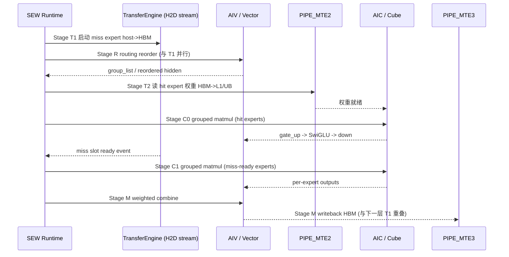

# Ascend MTE / AIC / AIV Pipeline MoE Offload 系统设计

> 本文是 SEW-Offload 系列的第 10 篇，聚焦**算子内流水**层面的系统设计。
>
> - 第 01、08 篇定义的是 **runtime 级 offloading**：`HostExpertStore`、`ExpertSlotBank`、
>   `TransferEngine`、`PrefetchPlanner`、`PhaseScheduler`。它们解决的是
>   “哪些 expert 留在 HBM、何时从 host 搬到 HBM slot、按几个 phase 算”。
> - 本文解决的是更靠下的一层问题：**当 expert 权重已经在 HBM slot 中、进入 grouped MoE 计算时，
>   如何把 MoE 执行拆成搬运 / routing reorder / resident compute / staged compute / combine 等阶段，
>   并把这些阶段映射到 Ascend AI Core 内部的 MTE、Cube(AIC)、Vector(AIV) 三类执行管线上做流水重叠。**
>
> 两层设计是互补的，不替代第 01/08 篇的 runtime 抽象。本文不修改 MoE 模型语义。

---

## 1. 背景：Ascend AI Core 的三类执行管线

当前目标机为 `aarch64` + CANN 8.5.1。Ascend AI Core 内部把指令分发到不同的执行单元，
彼此可以并行，靠显式同步事件（flag/queue）保证依赖正确：

| 管线 | 角色 | 典型方向 | 在 MoE 中的用途 |
| --- | --- | --- | --- |
| `PIPE_MTE2` | 外部内存 → 片上 | `GM/HBM -> L1/UB/L0` | 把 expert 权重、hidden 从 HBM 读进片上缓存 |
| `PIPE_MTE1` | 片上 → 片上 | `L1/CBUF -> L0A/L0B/UB` | 给 Cube 矩阵计算做数据准备 |
| `PIPE_MTE3` | 片上 → 外部内存 | `UB/L1 -> GM/HBM` | 把 expert 输出 / 中间结果写回 HBM |
| `AIC` (Cube) | 矩阵计算单元 | `L0A,L0B -> L0C` | gate_up matmul、down matmul |
| `AIV` (Vector) | 向量计算单元 | `UB -> UB` | routing reorder、SwiGLU、scale、combine 加权求和 |

设计的核心动机和 CANN 算子 `CopyIn / Compute / CopyOut` 三段流水一致：

```text
当前 tile 在 Cube/Vector 上计算时，下一块 tile 已经由 MTE2 从 HBM 搬进 L1/UB。
```

MoE offloading 场景下，HBM slot 本身可能也是“刚从 host 搬上来”的，所以**搬运链路更长**：

```text
host expert store --(runtime TransferEngine, H2D)--> HBM slot
HBM slot          --(PIPE_MTE2)--------------------> L1/UB
L1/UB             --(PIPE_MTE1)--------------------> L0A/L0B
L0A/L0B           --(AIC Cube)----------------------> L0C
L0C/UB            --(AIV Vector)--------------------> UB (SwiGLU/combine)
UB                --(PIPE_MTE3)--------------------> HBM 输出
```

本文要把 MoE 执行沿这条链路拆段，并让相邻段尽量在不同管线上重叠。

---

## 2. 设计目标与不变量

### 2.1 目标

延续 SEW-Offload 的主指标，把暴露在关键路径上的等待时间最小化：

```text
exposed_stall = max(0, transfer_time - overlap_time)
```

在算子内流水层面，`overlap_time` 进一步细分为：

```text
overlap_time =
    routing_reorder_time(AIV)        # 用 reorder 掩盖权重 MTE2 搬运
  + resident_compute_time(AIC/AIV)   # 用已驻留 expert 的计算掩盖 miss expert 搬运
  + prev_layer_tail_time             # 用上一层 combine/MTE3 尾巴掩盖本层权重预取
```

### 2.2 不变量（与第 00/01/08 篇一致，必须保持）

- 不改 router logits、top-k、gate weights、token dispatch / combine 语义。
- 不 drop token / expert，不做 expert 近似替代。
- 不让 CPU tensor 进入 `npu_grouped_matmul`：进入 Cube 的权重必须已在 HBM slot 中。
- slot tensor 地址、shape、dtype、layout 保持稳定，便于 ACLGraph / NPUGraph replay。
- 默认关闭，低侵入集成。

---

## 3. MoE 执行的阶段拆分

把单层 MoE 的 fused expert 执行拆成 5 个阶段。每个阶段标注其**主导管线**，
这是后续做流水重叠的依据。

```text
Stage T  Transfer / 搬运        : runtime H2D + PIPE_MTE2  (HBM slot -> L1/UB)
Stage R  Routing Reorder        : AIV                      (token 按 expert 分组重排)
Stage C0 Resident Compute       : AIC + AIV                (已驻留 expert 的 grouped MLP)
Stage C1 Staged Compute         : AIC + AIV                (miss-ready expert 的 grouped MLP)
Stage M  Combine                : AIV + PIPE_MTE3          (按 topk_weight 加权求和并写回)
```

### 3.1 Stage T — Transfer / 搬运

输入：`PrefetchPlanner` 给出的 miss/prefetch 计划与 `ExpertSlotBank` 的 slot 地址。

两段搬运要区分清楚，分别由不同引擎负责：

1. **host → HBM slot**：由 runtime 的 `TransferEngine` 在独立 `torch.npu.Stream` 上完成（第 08 篇 8.5）。
   这是 offloading 的主要开销来源。
2. **HBM slot → 片上 (L1/UB)**：由算子内 `PIPE_MTE2` 完成，属于正常 grouped matmul 的 CopyIn。

设计要点：

- Stage T 的第 1 段必须尽量提前发起，并用 Stage R / Stage C0 的计算窗口覆盖。
- 第 2 段（MTE2）是 Cube 计算的天然前置，按 tiling 双缓冲（double buffering）即可隐藏。
- slot 权重 layout 固定，避免在 Stage T 里做 runtime repack，否则会额外占用 AIV/MTE1。

### 3.2 Stage R — Routing Reorder

把 `topk_ids` 对应的 token 按 expert 分组，产出 grouped matmul 需要的 `group_list` /
`expert_token_nums` 与重排后的 hidden。这一步是纯向量/搬运操作，主导 AIV（部分 gather 走 MTE）。

关键价值：**Stage R 与 Stage T 第 1 段天然可重叠**。

```text
t0: 发起 miss expert 的 host->HBM 搬运 (TransferEngine, 旁路 stream)
t0: 同时在主 stream 上做 routing reorder (AIV)
```

routing reorder 通常只依赖 `topk_ids` 和 hidden，不依赖 expert 权重，所以可以在权重还在路上时先算。

### 3.3 Stage C0 — Resident Compute（hit-first）

只对**已经 ready 的 slot-hit expert**做 grouped MLP：

```text
gate_up = grouped_matmul(hidden_grouped, w13_slot)   # AIC Cube
act     = swiglu(gate_up)                            # AIV Vector
out0    = grouped_matmul(act, w2_slot)               # AIC Cube
```

这是 hit-first phased execution 的算子内体现：用 hit expert 的 Cube/Vector 计算时间，
覆盖 miss expert 仍在进行的 host→HBM 搬运（Stage T 第 1 段）。

### 3.4 Stage C1 — Staged Compute（miss-ready）

当 miss expert 的 slot 通过 `wait_until_ready` 完成搬运后，对其做第二段 grouped MLP。
结构与 Stage C0 相同，只是输入是不同的 expert 子集与 token 子集。

phase 切分沿用第 08 篇 8.7 的决策规则：

```text
if predicted_transfer_time > split_overhead
   and resident_compute_time > useful_overlap_threshold:
       Stage C0 先算 hit expert，Stage C1 再算 miss-ready expert
else:
       合并成单个 grouped phase，等所有 slot ready 再算
```

### 3.5 Stage M — Combine

把 Stage C0 / C1 的 per-expert 输出按 `topk_weights` 加权求和，写回 HBM：

```text
combined = scatter_add(out0, out1, topk_weights)   # AIV Vector
hbm_out  = combined                                # PIPE_MTE3 写回
```

设计要点：**Stage M 的 MTE3 写回尾巴可以与下一层的 Stage T 第 1 段重叠**，
即“本层在写结果，下一层的 miss expert 已经开始从 host 往 HBM 搬”。这就是 2.1 节里的
`prev_layer_tail_time`。

---

## 4. 流水重叠模型

把 5 个阶段沿管线展开，理想稳态下相邻阶段在不同管线上并行。

```text
管线\时间 ──────────────────────────────────────────────────────────►

H2D(旁路)  │ T(miss@layer i) │            │ T(miss@layer i+1)│
MTE2       │     │ load w_hit │ load w_miss│      │ load ...   │
AIV        │ R(reorder)      │ swiglu C0  │ swiglu C1 │ M combine│
AIC(Cube)  │       │ C0 gemm  │ C1 gemm    │           │
MTE3       │                 │            │           │ M writeback │
```

重叠关系（每条都是“用左边的计算掩盖右边的搬运”）：

| 被掩盖的搬运 | 用于掩盖的计算 | 跨越边界 |
| --- | --- | --- |
| miss expert host→HBM (Stage T1) | Stage R + Stage C0 | 层内 |
| HBM→L1/UB 权重读入 (MTE2) | 上一 tile 的 Cube 计算 | tile 内（double buffer） |
| 本层 Stage M 的 MTE3 写回 | 下一层 Stage T1 发起 | 跨层 |
| 下一 decode step 同层 expert 预取 | 本 step 的尾段 combine | 跨 step |

数据流时序：



---

## 5. 同步与正确性

跨管线重叠的本质是“放松依赖、显式同步”。三类同步事件必须明确：

1. **H2D 完成事件**（runtime 层）：`torch.npu.Event`，由 `TransferEngine` 在 H2D stream 上 record，
   Stage C1 在主 stream 上 `wait`。Stage C0 永不依赖该事件（这正是 hit-first 能重叠的原因）。
2. **slot 占用保护**：进入 Stage C0/C1 的 slot 处于 `Computing`，`TransferEngine` 不得覆盖；
   slot 状态机沿用第 08 篇 8.4。
3. **算子内 pipe flag**（MTE2/MTE1/Cube/Vector 之间）：由 CANN/AscendC 的 grouped matmul 内部维护，
   SEW 不手写，但 tiling/double-buffer 参数会影响重叠效果。

正确性不变量：

- Stage C0 与 Stage C1 处理的是**不相交的 expert 子集和 token 子集**，combine 时严格按
  `topk_ids/topk_weights` 归位，结果与单 phase grouped MoE 数值等价（仅浮点累加顺序可能不同）。
- 任一 slot 未 ready 时绝不进入对应 Cube 计算；宁可退化为单 phase 等待，也不让 CPU tensor 进 Cube。
- 关闭开关时，执行路径必须与现有 fused MoE 完全一致（对象身份不变）。

---

## 6. 与现有模块的集成

接入点仍然是第 08 篇 6 节确定的最低风险边界 `AscendUnquantizedFusedMoEMethod.apply()`：

```text
select_experts(...) -> topk_ids, topk_weights
  -> [SEW] runtime 查询 residency / 发起 Stage T1
  -> build_fused_experts_input(...)          # 含 Stage R routing reorder
  -> [SEW] Stage C0 hit-first grouped compute
  -> [SEW] wait miss slots, Stage C1 grouped compute
  -> [SEW] Stage M combine
```

模块映射（复用现有 `vllm_ascend/moe_offload/`，不新增 runtime 抽象）：

| 本文阶段 | 复用模块 | 说明 |
| --- | --- | --- |
| Stage T | `transfer_engine.py` / `slot_bank.py` / `host_store.py` | host→HBM 与 slot 管理已存在 |
| Stage R | 现有 `ops/fused_moe` 的 token 分组 | 不改 dispatch 语义 |
| Stage C0/C1 | `runtime.py` 的 phase 调度 + 现有 grouped matmul | 本文给出 pipe 级重叠依据 |
| Stage M | 现有 fused MoE combine | 仅补充 MTE3/跨层重叠时序约束 |

新增的只是一个**算子内流水编排器**（建议 `vllm_ascend/moe_offload/pipeline.py`），
它不持有权重，只负责：发起 Stage T1、选择是否切分 C0/C1、放置 npu event wait、记录 pipe 级指标。

新增环境变量（集中在 `vllm_ascend/envs.py`，默认关闭）：

```text
VLLM_ASCEND_MOE_PIPELINE_ENABLED=0          # 总开关
VLLM_ASCEND_MOE_PIPELINE_HITFIRST=1         # C0/C1 切分（依赖上面总开关）
VLLM_ASCEND_MOE_PIPELINE_CROSSLAYER_PREFETCH=0  # Stage M 尾巴重叠下一层 T1
```

---

## 7. 指标

在第 08 篇 8.9 Metrics 基础上补充 pipe 级 counter，用于判断瓶颈在搬运还是计算
（对应本机 profiler 的 `mte2_time(us)` / `mte3_time(us)` / cube/vector time 指标）：

```text
moe_pipeline_stage_t_host_h2d_ms      # Stage T1 host->HBM 时间
moe_pipeline_stage_t_mte2_ms          # Stage T2 HBM->片上 (近似 mte2_time)
moe_pipeline_stage_r_reorder_ms       # Stage R AIV reorder
moe_pipeline_stage_c0_compute_ms      # 驻留 expert Cube+Vector
moe_pipeline_stage_c1_compute_ms      # miss-ready expert Cube+Vector
moe_pipeline_stage_m_combine_ms       # combine
moe_pipeline_stage_m_mte3_ms          # 写回 (近似 mte3_time)
moe_pipeline_exposed_stall_ms         # max(0, T1 - (R + C0 + prev_tail))
moe_pipeline_crosslayer_overlap_ms    # Stage M 与下一层 T1 的重叠时长
```

诊断规则（与本机 `msaicerr` / profiler 经验一致）：

- `stage_t_mte2_ms` 偏高 → 被权重读入卡住，检查 tiling / double-buffer / slot 对齐。
- `exposed_stall_ms` 偏高但 `c0_compute_ms` 很小 → hit expert 太少，覆盖窗口不足，应回退单 phase 或加大 slot budget。
- MTE 地址越界 / vector core abnormal → 检查 slot stride、burst、alignment，绝不让未 ready / CPU tensor 进 Cube。

---

## 8. 分阶段落地建议

承接第 09 篇里程碑（MVP-A..G），本文对应 **MVP-F/MVP-G 之后**的细化方向：

| 阶段 | 内容 | 是否改执行 |
| --- | --- | --- |
| P0 | 在 phased execution 路径上加 pipe 级 timing 埋点（trace-only，不改重叠） | 否 |
| P1 | Stage R 与 Stage T1 显式并行：reorder 在主 stream、H2D 在旁路 stream | 是 |
| P2 | Stage C0 hit-first 与 miss 搬运重叠，补 npu event wait | 是 |
| P3 | Stage M 的 MTE3 尾巴与下一层 Stage T1 跨层重叠（受 `CROSSLAYER_PREFETCH` 控制） | 是 |
| P4 | slot layout / phase shape 做 bucket，便于 ACLGraph replay（接第 09 篇 MVP-G） | 是 |

每一步都要：默认关闭、保留单 phase 回退路径、数值等价验证、pipe 指标可观测。

---

## 10. P0 实测结果与分析（2026-06-02）

### 10.1 实验配置

| 项目 | 值 |
| --- | --- |
| 硬件 | 单卡 Ascend 910B3 (NPU 4)，64GB HBM |
| 软件栈 | CANN 8.5.1，vLLM 0.17.2 + vllm-ascend-hust `research` 分支 |
| 模型 | Qwen3-30B-A3B（128 experts, top-8, d_model=2048, moe_intermediate=768） |
| 调度 | `max_num_seqs=1`, `max_model_len=512`, `enforce_eager=True`, chunked prefill |
| Offload 配置 | `num_slots=8`, `fanout_threshold=8`, `resident_layer_ids=1..47`, `release_original_expert_weights`, `layered_runtime`, native prefetch expert offload（group_size=4, num_in_group=1, prefetch_step=1） |
| Pipeline profiling | `VLLM_ASCEND_MOE_PIPELINE_PROFILING=1`（P0 trace-only） |
| Prompt | `"Hello"`, 8 output tokens |

### 10.2 整体指标

| 指标 | 值 |
| --- | --- |
| 模型加载 | 65.7 s |
| 上报权重内存 | 42.35 GB（resident: layers 1–47; layer 0 non-resident + release） |
| Throughput | 1.60 tok/s |
| TTFT | 1392 ms |
| TPOT | 516 ms |
| Token-id correctness | `ok`（与 no-offload baseline strict compare 一致） |

### 10.3 Stage 级耗时明细

**A. 驻留 MoE 层（layer_id ∈ {1..47}，resident，无需 host→HBM）**

共 327 个采样点（每层每 decode step 一条 record）。权重已在 HBM 中，
`_maybe_apply_moe_offload_plan` 对 resident 层直接返回 `fused_experts_input`，
Stage T 只包含一次即时决策耗时。

| 阶段 | 平均耗时 (ms) | 管线映射 |
| --- | --- | --- |
| Stage T | 0.112（≈ 决策开销） | — |
| Stage R | 0.240 | AIV routing reorder |
| Stage C | 0.334 | AIC Cube gate_up/down + AIV SwiGLU |
| Stage M | 0.244 | AIV combine + PIPE_MTE3 writeback |
| **R+C+M 合计** | **0.819** | — |

**B. Slot-cache 层（layer_id = 0，non-resident，需 host→HBM 搬运 8 个 expert）**

共 9 条 record（1 次 prefill 触发 + 8 次 decode）。prefill 的 R/C/M 显著偏大
（token 数多、grouped matmul 尺寸大），以下按稳态 decode（排除 prefill 和首次 decode
冷启动）统计 7 个采样点。

| 阶段 | 平均耗时 (ms) | 占单层总时间比例 | 管线映射 |
| --- | --- | --- | --- |
| **Stage T** | **13.41** | **93.0%** | host→HBM `copy_()`（TransferEngine.load_sync） |
| Stage R | 0.38 | 2.6% | AIV routing reorder |
| Stage C | 0.36 | 2.5% | AIC Cube + AIV SwiGLU |
| Stage M | 0.27 | 1.9% | AIV combine + PIPE_MTE3 |
| **R+C+M 合计** | **1.01** | **7.0%** | — |

每个 decode step 的逐条数据：

```
decode #2:  T=12.42  R=0.343  C=0.380  M=0.278  R+C+M=1.001  T/(R+C+M)=12.4x
decode #3:  T=15.18  R=0.375  C=0.368  M=0.267  R+C+M=1.010  T/(R+C+M)=15.0x
decode #4:  T=11.30  R=0.368  C=0.369  M=0.238  R+C+M=0.975  T/(R+C+M)=11.6x
decode #5:  T=10.01  R=0.523  C=0.173  M=0.298  R+C+M=0.994  T/(R+C+M)=10.1x
decode #6:  T=13.33  R=0.398  C=0.376  M=0.268  R+C+M=1.042  T/(R+C+M)=12.8x
decode #7:  T=18.20  R=0.382  C=0.371  M=0.249  R+C+M=1.002  T/(R+C+M)=18.2x
decode #8:  T=13.40  R=0.387  C=0.371  M=0.259  R+C+M=1.018  T/(R+C+M)=13.2x
─────────
MEAN:      T=13.41  R=0.397  C=0.344  M=0.265  R+C+M=1.006  T/(R+C+M)=13.3x
```

### 10.4 关键比值

```text
T / (R+C+M)    ≈ 13.3x    # 搬运是计算的 13 倍
T / total      ≈ 93.0%    # 搬运占单层总时间的 93%
(R+C+M) / T   ≈  7.5%    # 计算窗口最多能掩盖 7.5% 的搬运
```

单层 slot-cache 耗时 ≈ 14.4 ms，其中约 13.4 ms 花在 host→HBM 搬运 8 个 expert
（每个 expert 约 3 MB，共约 24 MB，对应约 1.8 GB/s 的有效带宽）。
单层 resident 耗时 ≈ 0.93 ms。

### 10.5 对算子内流水优化的影响评估

报告第 3–4 节提出的 P1–P4 优化（Stage R 与 T 并行、C0 hit-first、跨层重叠等）
依赖于一个关键假设：

```text
overlap_time = R + C0 + prev_tail  ≥  useful_fraction × transfer_time
```

本次实测表明这个假设在当前配置下**不成立**：

1. **层内重叠潜力极小**：即使把 Stage R（0.38ms）和 Stage C（0.36ms）与 Stage T 完美重叠，
   也只能藏掉 0.74ms，仅占 13.41ms 搬运的 5.5%。暴露的 `exposed_stall` 仍约 12.7ms。

2. **跨层重叠帮助有限**：Stage M 仅 0.27ms，用它去掩盖下一层的 Stage T（13.4ms）
   是不现实的——下一层的 Stage T 需要约 50 个本层 Stage M 时长才能被完全遮挡。

3. **C0/C1 切分无意义**：在没有 async transfer 的当前同步模式下，Stage T 必须在
   Stage C 之前完成，无法拆分 hit/miss。即便改成 async，hit-only C0 只有 resident
   层的计算量（0.36ms），覆盖窗口依然太小。

4. **瓶颈在搬运带宽，不在流水编排**：单 expert 约 3 MB，8 个 expert 共 24 MB，
   13.4ms 的搬运意味着有效带宽约 1.8 GB/s——远低于 PCIe 4.0 x16 理论值（~25 GB/s
   单向）和 Ascend 910B H2D 理论带宽。排查方向：
   - 当前 `TransferEngine.load_sync` 使用逐 expert 的 `copy_()` 而非批量 DMA
   - 可能受 CPU→HBM 的 D2H copy engine 数量限制
   - Native prefetch 路径可能引入了额外的 CPU 侧开销

### 10.6 建议的优先方向

基于以上数据，**算子内 MTE/AIC/AIV 流水重叠（P1–P4）在当前瓶颈结构下收益极低**。
建议优先级调整为：

| 优先级 | 方向 | 预期收益 |
| --- | --- | --- |
| **P0** | 增大 slot budget / 减少 miss expert 数 | 直接减少 Stage T 触发次数和总量 |
| **P0** | 排查 H2D 有效带宽（批量 DMA vs 逐 expert copy） | 可能把 13.4ms 降到 2–3ms |
| P1 | 跨层 prefetch：本层还在算时就提前发起下一层 H2D | 用 47 层 resident 的总计算窗（~38ms）覆盖少数 miss 层的搬运 |
| P2 | async transfer + npu.Event wait（MVP-E） | 不减少搬运时间，但释放主 stream |
| P3 | 算子内 MTE/AIC/AIV 重叠（仅当 H2D 降至 ~2ms 后才有意义） | 此时 R+C≈0.74ms 能覆盖 37% 的搬运 |

### 10.7 复现命令

```bash
ASCEND_RT_VISIBLE_DEVICES=4 python tools/sew_offload/run_fixed_slot_smoke.py \
  --mode fixed_slot_sync \
  --inline-prompt "Hello" \
  --inline-max-output-tokens 8 \
  --num-slots 8 \
  --resident-layer-ids "1,2,...,47" \
  --release-original-expert-weights \
  --layered-runtime \
  --fanout-threshold 8 \
  --moe-pipeline-profiling \
  --gpu-memory-utilization 0.80 \
  --output-dir artifacts/sew_offload/runs/pipe_profile_fixed_slot_8tok_20260602
```

P0 实现代码位于 `vllm_ascend/moe_offload/pipeline.py`（`MoePipelineProfiler`），
hook 点在 `vllm_ascend/ops/fused_moe/moe_comm_method.py` 的 `fused_experts()`。
环境变量 `VLLM_ASCEND_MOE_PIPELINE_PROFILING=1` 控制开关（默认关闭）。
