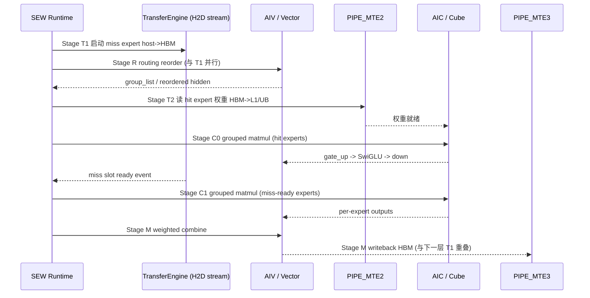

# Ascend MTE / AIC / AIV Pipeline MoE Offload 系统设计

> 本文是 SEW-Offload 系列的第 10 篇，聚焦**算子内流水**层面的系统设计。
>
> - 第 01、08 篇定义的是 **runtime 级 offloading**：`HostExpertStore`、`ExpertSlotBank`、
>   `TransferEngine`、`PrefetchPlanner`、`PhaseScheduler`。它们解决的是
>   “哪些 expert 留在 HBM、何时从 host 搬到 HBM slot、按几个 phase 算”。
> - 本文解决的是更靠下的一层问题：**当 expert 权重已经在 HBM slot 中、进入 grouped MoE 计算时，
>   如何把 MoE 执行拆成搬运 / routing reorder / resident compute / staged compute / combine 等阶段，
>   并把这些阶段映射到 Ascend AI Core 内部的 MTE、Cube(AIC)、Vector(AIV) 三类执行管线上做流水重叠。**
>
> 两层设计是互补的，不替代第 01/08 篇的 runtime 抽象。本文不修改 MoE 模型语义。

> **⚠️ 2026-06 实测更新（必读）：** 在 NPU 4 / Qwen3-30B-A3B / `num_slots=8` / 仅 layer 0 做
> slot-cache 的同步 `copy_()` 配置下，稳态 decode 的瓶颈被实测确认为 **Stage T（host→HBM 搬运）
> 占 ~93%**，R+C+M 合计只占 ~7%。这意味着**本文原先主推的算子内流水重叠（P1–P4）在当前
> bottleneck 比例下收益极小**（理论上限仅 ~7.5%，约 1ms，剩余 ~12.4ms 搬运裸暴露）。
> 设计方向已据此修正：**优先减少 miss 搬运量（更大 slot budget / 更多 resident 层）与 async
> 跨层 prefetch，而非算子内 pipe 重叠。** 详见第 8 节「实测结果与方向修正」。

---

## 1. 背景：Ascend AI Core 的三类执行管线

当前目标机为 `aarch64` + CANN 8.5.1。Ascend AI Core 内部把指令分发到不同的执行单元，
彼此可以并行，靠显式同步事件（flag/queue）保证依赖正确：

| 管线 | 角色 | 典型方向 | 在 MoE 中的用途 |
| --- | --- | --- | --- |
| `PIPE_MTE2` | 外部内存 → 片上 | `GM/HBM -> L1/UB/L0` | 把 expert 权重、hidden 从 HBM 读进片上缓存 |
| `PIPE_MTE1` | 片上 → 片上 | `L1/CBUF -> L0A/L0B/UB` | 给 Cube 矩阵计算做数据准备 |
| `PIPE_MTE3` | 片上 → 外部内存 | `UB/L1 -> GM/HBM` | 把 expert 输出 / 中间结果写回 HBM |
| `AIC` (Cube) | 矩阵计算单元 | `L0A,L0B -> L0C` | gate_up matmul、down matmul |
| `AIV` (Vector) | 向量计算单元 | `UB -> UB` | routing reorder、SwiGLU、scale、combine 加权求和 |

设计的核心动机和 CANN 算子 `CopyIn / Compute / CopyOut` 三段流水一致：

```text
当前 tile 在 Cube/Vector 上计算时，下一块 tile 已经由 MTE2 从 HBM 搬进 L1/UB。
```

MoE offloading 场景下，HBM slot 本身可能也是“刚从 host 搬上来”的，所以**搬运链路更长**：

```text
host expert store --(runtime TransferEngine, H2D)--> HBM slot
HBM slot          --(PIPE_MTE2)--------------------> L1/UB
L1/UB             --(PIPE_MTE1)--------------------> L0A/L0B
L0A/L0B           --(AIC Cube)----------------------> L0C
L0C/UB            --(AIV Vector)--------------------> UB (SwiGLU/combine)
UB                --(PIPE_MTE3)--------------------> HBM 输出
```

本文要把 MoE 执行沿这条链路拆段，并让相邻段尽量在不同管线上重叠。

---

## 2. 设计目标与不变量

### 2.1 目标

延续 SEW-Offload 的主指标，把暴露在关键路径上的等待时间最小化：

```text
exposed_stall = max(0, transfer_time - overlap_time)
```

在算子内流水层面，`overlap_time` 进一步细分为：

```text
overlap_time =
    routing_reorder_time(AIV)        # 用 reorder 掩盖权重 MTE2 搬运
  + resident_compute_time(AIC/AIV)   # 用已驻留 expert 的计算掩盖 miss expert 搬运
  + prev_layer_tail_time             # 用上一层 combine/MTE3 尾巴掩盖本层权重预取
```

### 2.2 不变量（与第 00/01/08 篇一致，必须保持）

- 不改 router logits、top-k、gate weights、token dispatch / combine 语义。
- 不 drop token / expert，不做 expert 近似替代。
- 不让 CPU tensor 进入 `npu_grouped_matmul`：进入 Cube 的权重必须已在 HBM slot 中。
- slot tensor 地址、shape、dtype、layout 保持稳定，便于 ACLGraph / NPUGraph replay。
- 默认关闭，低侵入集成。

---

## 3. MoE 执行的阶段拆分

把单层 MoE 的 fused expert 执行拆成 5 个阶段。每个阶段标注其**主导管线**，
这是后续做流水重叠的依据。

```text
Stage T  Transfer / 搬运        : runtime H2D + PIPE_MTE2  (HBM slot -> L1/UB)
Stage R  Routing Reorder        : AIV                      (token 按 expert 分组重排)
Stage C0 Resident Compute       : AIC + AIV                (已驻留 expert 的 grouped MLP)
Stage C1 Staged Compute         : AIC + AIV                (miss-ready expert 的 grouped MLP)
Stage M  Combine                : AIV + PIPE_MTE3          (按 topk_weight 加权求和并写回)
```

### 3.1 Stage T — Transfer / 搬运

输入：`PrefetchPlanner` 给出的 miss/prefetch 计划与 `ExpertSlotBank` 的 slot 地址。

两段搬运要区分清楚，分别由不同引擎负责：

1. **host → HBM slot**：由 runtime 的 `TransferEngine` 在独立 `torch.npu.Stream` 上完成（第 08 篇 8.5）。
   这是 offloading 的主要开销来源。
2. **HBM slot → 片上 (L1/UB)**：由算子内 `PIPE_MTE2` 完成，属于正常 grouped matmul 的 CopyIn。

设计要点：

- Stage T 的第 1 段必须尽量提前发起，并用 Stage R / Stage C0 的计算窗口覆盖。
- 第 2 段（MTE2）是 Cube 计算的天然前置，按 tiling 双缓冲（double buffering）即可隐藏。
- slot 权重 layout 固定，避免在 Stage T 里做 runtime repack，否则会额外占用 AIV/MTE1。

### 3.2 Stage R — Routing Reorder

把 `topk_ids` 对应的 token 按 expert 分组，产出 grouped matmul 需要的 `group_list` /
`expert_token_nums` 与重排后的 hidden。这一步是纯向量/搬运操作，主导 AIV（部分 gather 走 MTE）。

关键价值：**Stage R 与 Stage T 第 1 段天然可重叠**。

```text
t0: 发起 miss expert 的 host->HBM 搬运 (TransferEngine, 旁路 stream)
t0: 同时在主 stream 上做 routing reorder (AIV)
```

routing reorder 通常只依赖 `topk_ids` 和 hidden，不依赖 expert 权重，所以可以在权重还在路上时先算。

### 3.3 Stage C0 — Resident Compute（hit-first）

只对**已经 ready 的 slot-hit expert**做 grouped MLP：

```text
gate_up = grouped_matmul(hidden_grouped, w13_slot)   # AIC Cube
act     = swiglu(gate_up)                            # AIV Vector
out0    = grouped_matmul(act, w2_slot)               # AIC Cube
```

这是 hit-first phased execution 的算子内体现：用 hit expert 的 Cube/Vector 计算时间，
覆盖 miss expert 仍在进行的 host→HBM 搬运（Stage T 第 1 段）。

### 3.4 Stage C1 — Staged Compute（miss-ready）

当 miss expert 的 slot 通过 `wait_until_ready` 完成搬运后，对其做第二段 grouped MLP。
结构与 Stage C0 相同，只是输入是不同的 expert 子集与 token 子集。

phase 切分沿用第 08 篇 8.7 的决策规则：

```text
if predicted_transfer_time > split_overhead
   and resident_compute_time > useful_overlap_threshold:
       Stage C0 先算 hit expert，Stage C1 再算 miss-ready expert
else:
       合并成单个 grouped phase，等所有 slot ready 再算
```

### 3.5 Stage M — Combine

把 Stage C0 / C1 的 per-expert 输出按 `topk_weights` 加权求和，写回 HBM：

```text
combined = scatter_add(out0, out1, topk_weights)   # AIV Vector
hbm_out  = combined                                # PIPE_MTE3 写回
```

设计要点：**Stage M 的 MTE3 写回尾巴可以与下一层的 Stage T 第 1 段重叠**，
即“本层在写结果，下一层的 miss expert 已经开始从 host 往 HBM 搬”。这就是 2.1 节里的
`prev_layer_tail_time`。

---

## 4. 流水重叠模型

把 5 个阶段沿管线展开，理想稳态下相邻阶段在不同管线上并行。

```text
管线\时间 ──────────────────────────────────────────────────────────►

H2D(旁路)  │ T(miss@layer i) │            │ T(miss@layer i+1)│
MTE2       │     │ load w_hit │ load w_miss│      │ load ...   │
AIV        │ R(reorder)      │ swiglu C0  │ swiglu C1 │ M combine│
AIC(Cube)  │       │ C0 gemm  │ C1 gemm    │           │
MTE3       │                 │            │           │ M writeback │
```

重叠关系（每条都是“用左边的计算掩盖右边的搬运”）：

| 被掩盖的搬运 | 用于掩盖的计算 | 跨越边界 |
| --- | --- | --- |
| miss expert host→HBM (Stage T1) | Stage R + Stage C0 | 层内 |
| HBM→L1/UB 权重读入 (MTE2) | 上一 tile 的 Cube 计算 | tile 内（double buffer） |
| 本层 Stage M 的 MTE3 写回 | 下一层 Stage T1 发起 | 跨层 |
| 下一 decode step 同层 expert 预取 | 本 step 的尾段 combine | 跨 step |

数据流时序：



---

## 5. 同步与正确性

跨管线重叠的本质是“放松依赖、显式同步”。三类同步事件必须明确：

1. **H2D 完成事件**（runtime 层）：`torch.npu.Event`，由 `TransferEngine` 在 H2D stream 上 record，
   Stage C1 在主 stream 上 `wait`。Stage C0 永不依赖该事件（这正是 hit-first 能重叠的原因）。
2. **slot 占用保护**：进入 Stage C0/C1 的 slot 处于 `Computing`，`TransferEngine` 不得覆盖；
   slot 状态机沿用第 08 篇 8.4。
3. **算子内 pipe flag**（MTE2/MTE1/Cube/Vector 之间）：由 CANN/AscendC 的 grouped matmul 内部维护，
   SEW 不手写，但 tiling/double-buffer 参数会影响重叠效果。

正确性不变量：

- Stage C0 与 Stage C1 处理的是**不相交的 expert 子集和 token 子集**，combine 时严格按
  `topk_ids/topk_weights` 归位，结果与单 phase grouped MoE 数值等价（仅浮点累加顺序可能不同）。
- 任一 slot 未 ready 时绝不进入对应 Cube 计算；宁可退化为单 phase 等待，也不让 CPU tensor 进 Cube。
- 关闭开关时，执行路径必须与现有 fused MoE 完全一致（对象身份不变）。

---

## 6. 与现有模块的集成

接入点仍然是第 08 篇 6 节确定的最低风险边界 `AscendUnquantizedFusedMoEMethod.apply()`：

```text
select_experts(...) -> topk_ids, topk_weights
  -> [SEW] runtime 查询 residency / 发起 Stage T1
  -> build_fused_experts_input(...)          # 含 Stage R routing reorder
  -> [SEW] Stage C0 hit-first grouped compute
  -> [SEW] wait miss slots, Stage C1 grouped compute
  -> [SEW] Stage M combine
```

模块映射（复用现有 `vllm_ascend/moe_offload/`，不新增 runtime 抽象）：

| 本文阶段 | 复用模块 | 说明 |
| --- | --- | --- |
| Stage T | `transfer_engine.py` / `slot_bank.py` / `host_store.py` | host→HBM 与 slot 管理已存在 |
| Stage R | 现有 `ops/fused_moe` 的 token 分组 | 不改 dispatch 语义 |
| Stage C0/C1 | `runtime.py` 的 phase 调度 + 现有 grouped matmul | 本文给出 pipe 级重叠依据 |
| Stage M | 现有 fused MoE combine | 仅补充 MTE3/跨层重叠时序约束 |

新增的只是一个**算子内流水编排器**（建议 `vllm_ascend/moe_offload/pipeline.py`），
它不持有权重，只负责：发起 Stage T1、选择是否切分 C0/C1、放置 npu event wait、记录 pipe 级指标。

新增环境变量（集中在 `vllm_ascend/envs.py`，默认关闭）：

```text
VLLM_ASCEND_MOE_PIPELINE_ENABLED=0          # 总开关
VLLM_ASCEND_MOE_PIPELINE_HITFIRST=1         # C0/C1 切分（依赖上面总开关，实测优先级降级，见第 8 节 D4）
VLLM_ASCEND_MOE_PIPELINE_CROSSLAYER_PREFETCH=0  # 已升级语义：layer i 计算时提前发起 layer i+1 的 H2D（D3）
VLLM_ASCEND_MOE_PIPELINE_ASYNC_H2D=0        # 旁路 stream + event wait，主 stream 不阻塞（D2）
```

> 实测后优先级（第 8 节）：先做 `ASYNC_H2D`（D2）与跨层 `CROSSLAYER_PREFETCH`（D3），
> 再考虑 `HITFIRST`（D4）。`HITFIRST` 在 Stage T 仍占 ~93% 时收益 ≤7.5%，暂不优先。

---

## 7. 指标

在第 08 篇 8.9 Metrics 基础上补充 pipe 级 counter，用于判断瓶颈在搬运还是计算
（对应本机 profiler 的 `mte2_time(us)` / `mte3_time(us)` / cube/vector time 指标）：

```text
moe_pipeline_stage_t_host_h2d_ms      # Stage T1 host->HBM 时间
moe_pipeline_stage_t_mte2_ms          # Stage T2 HBM->片上 (近似 mte2_time)
moe_pipeline_stage_r_reorder_ms       # Stage R AIV reorder
moe_pipeline_stage_c0_compute_ms      # 驻留 expert Cube+Vector
moe_pipeline_stage_c1_compute_ms      # miss-ready expert Cube+Vector
moe_pipeline_stage_m_combine_ms       # combine
moe_pipeline_stage_m_mte3_ms          # 写回 (近似 mte3_time)
moe_pipeline_exposed_stall_ms         # max(0, T1 - (R + C0 + prev_tail))
moe_pipeline_crosslayer_overlap_ms    # Stage M 与下一层 T1 的重叠时长
```

诊断规则（与本机 `msaicerr` / profiler 经验一致）：

- `stage_t_host_h2d_ms` 偏高（实测 ~13.4ms / 层，占 ~93%）→ **这是当前主瓶颈**：搬运量太大，
  优先走第 8 节 D1（更大 slot budget / 更多 resident 层减少 miss expert 数），其次 D2/D3 跨层 async prefetch。
- `stage_t_mte2_ms` 偏高 → 被权重读入卡住，检查 tiling / double-buffer / slot 对齐。
- `exposed_stall_ms` 偏高但 `c0_compute_ms` 很小 → hit expert 太少，覆盖窗口不足；实测表明算子内重叠
  窗口（R+C+M ≈1ms）本就太小，应优先减少搬运量或改跨层 prefetch，而非寄望于层内 hit-first。
- MTE 地址越界 / vector core abnormal → 检查 slot stride、burst、alignment，绝不让未 ready / CPU tensor 进 Cube。

---

## 8. 实测结果与方向修正

### 8.1 实测数据（2026-06，NPU 4 / Qwen3-30B-A3B）

配置：`num_slots=8`，仅 layer 0 做 slot-cache（其余 47 层 expert 权重 resident），
同步 `copy_()` 搬运。排除 prefill 与首次 decode 冷启动后的**稳态 decode** 单层 MoE 耗时：

| 阶段 | 耗时 (ms) | 占比 |
| --- | --- | --- |
| Stage T（host→HBM 搬运 8 个 expert） | ~13.4 | 93% |
| Stage R（routing reorder, AIV） | ~0.37 | 2.6% |
| Stage C（grouped matmul, AIC+AIV） | ~0.37 | 2.6% |
| Stage M（combine, AIV+MTE3） | ~0.26 | 1.8% |
| R + C + M 合计 | ~1.0 | 7% |

### 8.2 关键结论：算子内流水收益被实测否定

第 2.1 节假设 `overlap_time = routing_reorder + resident_compute + prev_layer_tail` 能吃掉相当一部分
搬运时间。**实测推翻了这个前提**：可用于重叠的 compute window（R+C+M）总共只有 ~1ms，
即使把它们与 Stage T **完美重叠**，理论上限也只有 ~7.5%，仅能掩盖 ~1ms：

```text
exposed_stall = max(0, transfer_time - overlap_time)
              ≈ max(0, 13.4 - 1.0)
              ≈ 12.4 ms   # 搬运裸暴露，占稳态 decode 单层的绝大部分
```

在当前同步 `copy_()` 模式、单层级 bottleneck 比例下，**算子内 pipeline（原 P1–P4）对降低
`exposed_stall` 的贡献微乎其微**。瓶颈不在「计算等搬运的次序」，而在「单次搬运的绝对体量」。

### 8.3 方向修正：先治搬运量，再谈重叠

优化优先级据实测重排，越靠前性价比越高：

| 优先级 | 方向 | 机理 | 预期收益 | 是否改执行 |
| --- | --- | --- | --- | --- |
| **D1（最高）** | **减少单次 transfer 量**：增大 slot budget、增加 resident 层 | 直接减少每层 miss expert 数 → 缩短 Stage T 绝对时间 | 与 miss 数近似线性，最大杠杆 | 是（配置/容量） |
| **D2** | **async transfer（接第 09 篇 MVP-E）**：H2D 旁路 stream + event wait | 不减少搬运绝对时间，但不再阻塞主 stream，给跨层重叠创造条件 | 解锁 D3 的前置条件 | 是 |
| **D3** | **prefetch ahead 跨层流水**：layer i 计算时提前发起 layer i+1 的 H2D | 用「整层」的 compute（而非单层 R+C+M）覆盖下一层搬运，窗口大得多 | 把覆盖窗口从 ~1ms 扩到「一整层时延」量级 | 是 |
| D4（降级） | 原 P1–P3 算子内 pipe 重叠（Stage R∥T、C0 hit-first、Stage M 尾巴重叠） | 层内 compute window 太小 | 当前 ≤7.5%，仅在 D1 把搬运压到与计算同量级后才值得做 | 是 |
| D5 | slot/phase shape bucket，便于 ACLGraph replay（接第 09 篇 MVP-G） | 降低 host launch，不解决搬运瓶颈 | 间接 | 是 |

要点说明：

- **D1 是当前唯一能改变 bottleneck 量级的方向**。layer 0 单层 slot-cache 就引入 13.4ms 搬运，
  说明 miss 体量主导一切；应优先用 simulator（第 09 篇 MVP-C）扫 `num_slots` 与 resident 层组合，
  找到「HBM 预算 vs miss 搬运」的拐点，把每层 miss expert 数压到最低。
- **D2 + D3 是 D1 之外第二有效的杠杆**。即便绝对搬运时间不变，跨层 prefetch 把覆盖窗口从
  「单层 R+C+M ≈1ms」放大到「上一整层的端到端计算时延」，这才是真正能藏住 12.4ms 的窗口来源。
  这也解释了为何原文 P3「Stage M 尾巴重叠下一层 T1」方向正确但**粒度太小**——应升级为
  「整层提前一层 prefetch」，而非只重叠 combine 尾巴。
- **D4（原 P1–P4）暂缓**。在 D1 把 Stage T 压到与 R+C+M 同量级之前，算子内重叠不值得投入。

### 8.4 修正后的落地顺序

| 阶段 | 内容 | 对应实测方向 | 是否改执行 |
| --- | --- | --- | --- |
| P0 | 保留 pipe 级 timing 埋点（已用于产出 8.1 数据） | 观测 | 否 |
| **P1'** | simulator 扫 `num_slots` / resident 层，定 miss 最小化配置 | D1 | 否（离线） |
| **P2'** | async H2D：旁路 stream + `torch.npu.Event` wait，主 stream 不阻塞 | D2 | 是 |
| **P3'** | 跨层 prefetch：layer i 计算时发起 layer i+1 的 H2D，用整层窗口覆盖 | D3 | 是 |
| P4' | （可选）回到算子内 Stage R∥T / C0 hit-first，仅当 D1 后搬运≈计算时 | D4 | 是 |

每一步仍须：默认关闭、保留同步回退路径、数值等价验证、pipe 指标可观测。

---

## 9. 一句话总结

**本文原先把 MoE 拆成 T/R/C0/C1/M 五段、用算子内管线重叠掩盖搬运；但 2026-06 实测显示稳态 decode
中 Stage T（host→HBM 搬运）独占 ~93%，可重叠的 R+C+M 仅 ~7%，算子内流水至多藏掉 ~1ms、留下 ~12.4ms
裸暴露。因此方向修正为：优先用更大 slot budget / 更多 resident 层减少 miss 搬运量（D1），再用 async
旁路搬运（D2）与跨层 prefetch（D3）以「整层计算窗口」覆盖搬运；算子内 pipe 重叠（原 P1–P4）降级为
搬运被压到与计算同量级之后的后续优化。**
