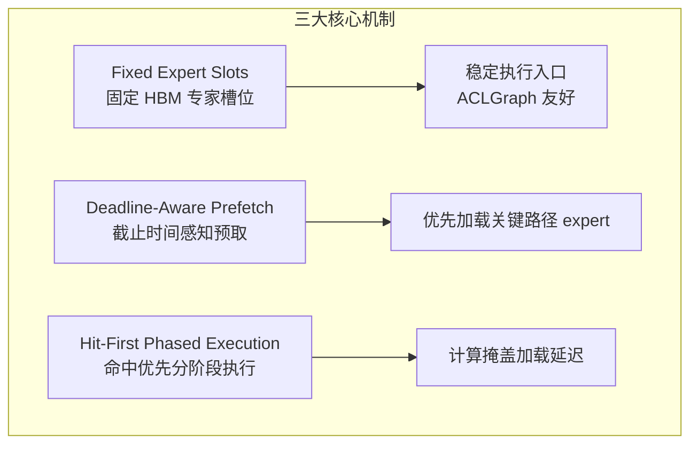
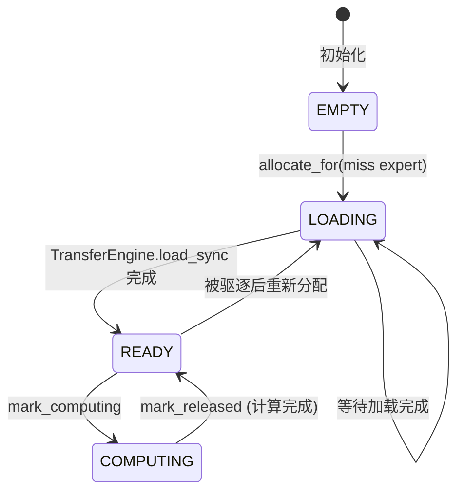
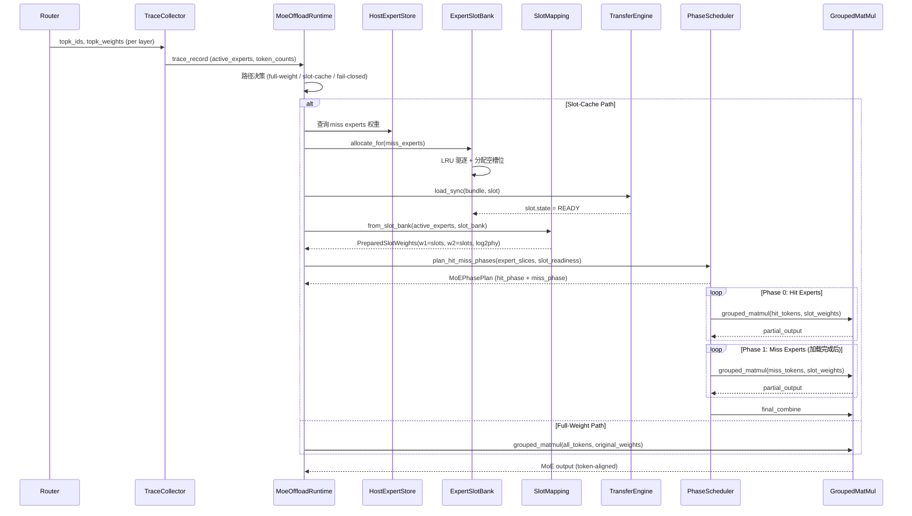
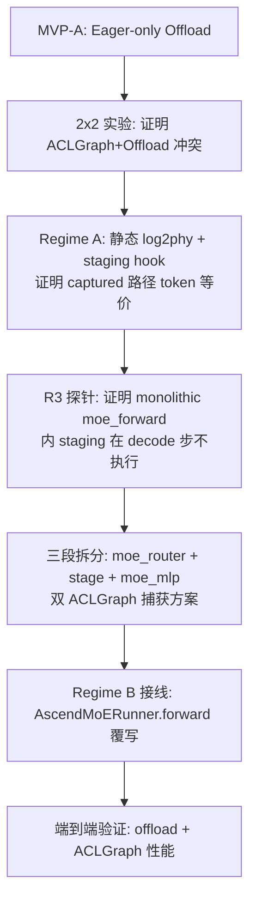

# SEW-Offload：Ascend NPU MoE 推理静态专家窗口调度架构说明书

> **版本**: v1.0  
> **日期**: 2026-06-25  
> **代码仓库**: `vllm-ascend-hust`（分支 `feature/moe-offload-runtime`）  
> **目标硬件**: 单卡 Ascend 910B3（~64 GB HBM）

---

## 目录

1. [背景与动机](#1-背景与动机)
2. [核心设计思想](#2-核心设计思想)
3. [系统架构总览](#3-系统架构总览)
4. [模块详解](#4-模块详解)
   - 4.1 [HostExpertStore — Host 侧专家权重存储](#41-hostexpertstore--host-侧专家权重存储)
   - 4.2 [ExpertSlotBank — 固定 HBM 专家槽位管理](#42-expertslotbank--固定-hbm-专家槽位管理)
   - 4.3 [ExpertSlotMapping — 逻辑到物理专家映射](#43-expertslotmapping--逻辑到物理专家映射)
   - 4.4 [TransferEngine — 数据搬运引擎](#44-transferengine--数据搬运引擎)
   - 4.5 [ResidencyPolicy — 槽位驱逐策略](#45-residencypolicy--槽位驱逐策略)
   - 4.6 [PhaseScheduler — Hit-First 分阶段执行](#46-phasescheduler--hit-first-分阶段执行)
   - 4.7 [TieredResidencyPolicy — 分层驻留策略](#47-tieredresidencypolicy--分层驻留策略)
   - 4.8 [LayeredStrategy — 分层运行时路径选择](#48-layeredstrategy--分层运行时路径选择)
   - 4.9 [ComputeBucket — 分组计算桶优化](#49-computebucket--分组计算桶优化)
   - 4.10 [AutoConfig — 自动配置推导](#410-autoconfig--自动配置推导)
   - 4.11 [TraceCollector & Pipeline — 追踪与分析](#411-tracecollector--pipeline--追踪与分析)
   - 4.12 [MoeOffloadRuntime — 核心运行时编排](#412-moeoffloadruntime--核心运行时编排)
   - 4.13 [moe_offload_stage / moe_router / moe_mlp — 三段拆分 Ops](#413-moe_offload_stage--moe_router--moe_mlp--三段拆分-ops)
5. [运行时数据流](#5-运行时数据流)
6. [两种运行体制](#6-两种运行体制)
7. [ACLGraph 兼容方案：控制面/数据面解耦与双图捕获](#7-aclgraph-兼容方案控制面数据面解耦与双图捕获)
   - 7.1 [问题起源：MoE Offload 为何最初只能走 Eager](#71-问题起源moe-offload-为何最初只能走-eager)
   - 7.2 [实验证据：ACLGraph vs Eager 的性能差距](#72-实验证据aclgraph-vs-eager-的性能差距)
   - 7.3 [双 ACLGraph 捕获方案：三段拆分 moe_forward](#73-双-aclgraph-捕获方案三段拆分-moe_forward)
   - 7.4 [两种 Regime 的不同解法](#74-两种-regime-的不同解法)
   - 7.5 [方案演进路线图](#75-方案演进路线图)
8. [Benchmark 分析](#8-benchmark-分析)
   - 8.1 [实验配置](#81-实验配置)
   - 8.2 [4 配置对比：ACLGraph vs Eager](#82-4-配置对比aclgraph-vs-eager全量驻留单请求)
   - 8.3 [2×2 冲突验证：Offload + ACLGraph](#83-22-冲突验证offload--aclgraph-同开直接失败)
   - 8.4 [Offload-14GB vs Non-Offload](#84-offload-14gb-vs-non-offloadsharegpt-200-条真实对话)
   - 8.5 [结果解读](#85-结果解读)
9. [关键技术指标](#9-关键技术指标)
10. [环境变量与配置](#10-环境变量与配置)
11. [文件索引](#11-文件索引)
12. [附录 A：与 vLLM Ascend 的集成边界](#12-附录-a与-vllm-ascend-的集成边界)
13. [附录 B：已知限制与后续工作](#13-附录-b已知限制与后续工作)

---

## 1. 背景与动机

### 1.1 问题场景

大模型 MoE（Mixture-of-Experts）推理面临一个核心矛盾：**每个 token 只激活少数专家（如 Top-8），但全部专家权重仍需完整存储**。以 Qwen3-30B-A3B 为例，48 层 MoE 每层 128 个专家，专家权重总规模远超单张 Ascend 910B3 的 ~64 GB HBM，尤其是在并发服务、长上下文 KV Cache 竞争显存的场景下。

### 1.2 GPU-style 方案的局限

GPU 上常见的 MoE offloading 方案（动态 expert cache + 预测预取 + stream overlap）在 Ascend NPU 上存在三类根本问题：

| 问题 | GPU-style 做法 | Ascend 上的困境 |
|------|---------------|----------------|
| **动态 buffer 破坏静态执行** | 加载到任意动态分配的 buffer | ACLGraph/Static Kernel 依赖固定 tensor 地址和 shape |
| **小执行单元代价高** | per-expert 单独加载+执行 | 大量小 kernel 带来 host launch 开销和 stream 同步压力 |
| **命中率不是真正目标** | 追求 cache hit rate | 真正的性能损失来自暴露在关键路径上的加载延迟 |

### 1.3 SEW-Offload 的设计目标

$$
T_{\text{stall}} = \max(0, T_{\text{load-miss}} - T_{\text{overlap}})
$$

- **不是最大化命中率**，而是 **最小化暴露在关键路径上的 stall 时间**。
- 如果 miss 加载能被 routing、dispatch、hit expert 计算、后续层计算覆盖，端到端延迟仍然可控。
- 不修改模型语义：不动 router logits、不动 top-k、不 drop token、不修改 gate weight。

---

## 2. 核心设计思想

### 2.1 三大机制



#### 机制一：Fixed Expert Slots（固定专家槽位）

HBM 中预分配固定数量的槽位 $\mathcal{S} = \{s_0, s_1, \ldots, s_{S-1}\}$，每个槽位有**固定地址、固定 shape、固定 layout、固定 dtype**。运行时只维护两个映射：

- $\texttt{expert\_to\_slot}: E \rightarrow \mathcal{S} \cup \{\bot\}$ — 专家到槽位
- $\texttt{slot\_to\_expert}: \mathcal{S} \rightarrow E \cup \{\bot\}$ — 槽位到专家

执行图始终看到稳定的 slot 入口，动态变化的只是槽位中驻留的专家身份。

#### 机制二：Deadline-Aware Prefetch（截止时间感知预取）

每个候选专家加载看作一个带 deadline 的任务。预取优先级考虑：

- 专家下次被使用的时间估计（deadline）
- 加载代价（host → HBM 拷贝时间）
- 执行价值（token 数、最近 locality、miss penalty）
- 驱逐代价（替换当前槽位所有者的开销）

#### 机制三：Hit-First Phased Execution（命中优先分阶段执行）

将 active experts 按槽位就绪状态分为两组：

- **Phase 0（Hit Phase）**：先执行已在 HBM 槽位中就绪的专家
- **Phase 1（Miss Phase）**：在 Phase 0 执行期间后台加载 miss 专家，完成后执行

计算覆盖加载延迟，保持 grouped matmul 的吞吐优势。

---

## 3. 系统架构总览

```
                         请求流 / Token 序列
                              │
                              ▼
                    ┌─────────────────┐
                    │   vLLM Engine   │
                    │  (Scheduler +   │
                    │   ModelRunner)  │
                    └────────┬────────┘
                             │
              ┌──────────────┼──────────────┐
              │              │              │
              ▼              ▼              ▼
        Router/       Attention/       MoE Layer
        Top-K         RMSNorm            │
                              ┌──────────┴──────────┐
                              │                     │
                     topk_ids/weights         MoE Forward
                              │                     │
                              ▼                     │
                    ┌─────────────────┐            │
                    │  TraceCollector │            │
                    │  (路由追踪)      │            │
                    └────────┬────────┘            │
                             │                     │
                             ▼                     │
              ┌──────────────────────────┐         │
              │   MoeOffloadRuntime      │◄────────┘
              │   ┌──────────────────┐   │
              │   │ TieredResidency  │   │  分层驻留决策
              │   │ LayeredStrategy  │   │  路径选择
              │   └──────────────────┘   │
              │   ┌──────────────────┐   │
              │   │ HostExpertStore  │   │  CPU 侧权重
              │   │ ExpertSlotBank   │   │  HBM 槽位
              │   │ SlotMapping      │   │  逻辑→物理映射
              │   │ TransferEngine   │   │  搬运执行
              │   │ ResidencyPolicy  │   │  驱逐策略
              │   └──────────────────┘   │
              │   ┌──────────────────┐   │
              │   │ PhaseScheduler   │   │  Hit-First 分阶段
              │   │ Pipeline         │   │  流水线计时
              │   │ ComputeBucket    │   │  分组计算桶
              │   └──────────────────┘   │
              │   ┌──────────────────┐   │
              │   │ AutoConfig       │   │  自动配置推导
              │   └──────────────────┘   │
              └──────────┬───────────────┘
                         │
                         ▼
              ┌─────────────────────┐
              │  Grouped MoE Backend│
              │  (npu_grouped_      │
              │   matmul + combine) │
              └─────────────────────┘
```

### 模块职责速览

| 模块 | 文件 | 核心职责 |
|------|------|---------|
| **HostExpertStore** | `host_store.py` | 管理 CPU 侧完整专家权重，提供按 (layer, expert) 检索 |
| **ExpertSlotBank** | `slot_bank.py` | HBM 固定槽位分配/驱逐/状态管理 |
| **ExpertSlotMapping** | `slot_mapping.py` | 构建 logical→physical 映射，支持 topk_ids remap |
| **TransferEngine** | `transfer_engine.py` | 执行 host→HBM slot 的数据拷贝 |
| **ResidencyPolicy** | `policy.py` | 槽位驱逐策略（LRU / StickyLayerLRU） |
| **PhaseScheduler** | `phase_split.py` | Hit-First 分阶段拆分与执行规划 |
| **TieredResidencyPolicy** | `tiered_residency.py` | 哪些层的专家全量驻留 NPU，哪些走 slot cache |
| **LayeredStrategy** | `layered_strategy.py` | 动态路径选择：full-weight vs slot-cache vs fail-closed |
| **ComputeBucket** | `compute_bucket.py` | 分组计算桶签名识别与 fast-path 路由 |
| **AutoConfig** | `autoconfig.py` | 根据目标 offload GB 自动推导 slot 数、驻留层等参数 |
| **TraceCollector** | `trace_collector.py` | 记录每层每步的 active experts 和 token 分布 |
| **Pipeline** | `pipeline.py` | MTE 搬运/路由重排/计算/Combine 各阶段耗时追踪 |
| **moe_offload_stage_op** | `ops/fused_moe/moe_offload_stage_op.py` | **Regime B 控制面缝合 op**（EAGER splitting op，列入 `splitting_ops`），在 Piece1 与 Piece2 之间执行 host 决策 + H2D staging + log2phy 写入 |
| **moe_router_op** | `ops/fused_moe/moe_router_op.py` | **三段拆分 Piece 1**（捕获），`select_experts` 的忠实 wrapper |
| **moe_mlp_op** | `ops/fused_moe/moe_mlp_op.py` | **三段拆分 Piece 3**（捕获），dispatch + gather log2phy + grouped matmul + combine |
| **MoeOffloadRuntime** | `runtime.py` | 顶层编排器，统一调度以上所有模块 |

---

## 4. 模块详解

### 4.1 HostExpertStore — Host 侧专家权重存储

**职责**：管理 CPU 内存中完整的专家权重副本，是 offload 场景下权重的"源头"。

```python
class HostExpertStore:
    def register_layer(self, layer: nn.Module) -> None:
        """从 MoE 层提取 w13_weight 和 w2_weight，
        为每个 expert 创建 .cpu().clone() 副本存储"""

    def get(self, layer_id: int, expert_id: int) -> ExpertWeightBundle:
        """按 (layer_id, expert_id) 检索权重 bundle"""

    def validate_complete_layers(self, expected_layer_ids) -> Report:
        """验证指定层所有 expert 权重完整性"""
```

**关键数据结构**：

```python
@dataclass(frozen=True)
class ExpertWeightBundle:
    layer_id: int      # 层编号
    expert_id: int     # 专家编号
    w13: Tensor        # gate+up 融合权重 (CPU)
    w2: Tensor         # down 权重 (CPU)
    w13_scale: Tensor | None  # 量化 scale（可选）
    w2_scale: Tensor | None   # 量化 scale（可选）
```

**设计考虑**：
- 当前使用 whole-expert 粒度（w13 + w2 一起加载）
- 预留了 w13_scale/w2_scale 字段，支持后续量化 offload
- 每次 register_layer 会清除旧数据并重新克隆，防止权重更新不一致

---

### 4.2 ExpertSlotBank — 固定 HBM 专家槽位管理

**职责**：HBM 中预分配固定数量的专家权重槽位，管理槽位生命周期。

```python
class ExpertSlotBank:
    def __init__(self, num_slots, w13_shape, w2_shape, dtype, device):
        # 预分配固定地址的 HBM 大张量
        self.w13_slots = torch.empty((num_slots, *w13_shape), ...)  # [S, I, H]*2
        self.w2_slots  = torch.empty((num_slots, *w2_shape), ...)   # [S, H, I]

    def allocate_for(self, expert_key, step_id) -> ExpertSlot:
        """为 expert 分配槽位（命中返回已有，miss 走 empty/LRU 驱逐）"""

    def lookup(self, expert_key) -> ExpertSlot | None:
        """查询 expert 是否已在槽位中"""
```

**槽位状态机**：



**关键属性**：
- `w13_slots` / `w2_slots` 的地址、shape、layout **在整个推理生命周期中不变**
- 每个 slot 维护 `version` 计数，防止使用过时映射
- `last_used_step` 跟踪最近使用时间，供 LRU 驱逐参考

**驱逐策略**（`_lru_evictable_slot`）：
1. 优先驱逐状态为 READY 且 last_used_step 最小的 slot
2. 不驱逐 COMPUTING（正在计算）或 LOADING（正在加载）的 slot
3. 不驱逐当前层正在使用的 expert

---

### 4.3 ExpertSlotMapping — 逻辑到物理专家映射

**职责**：构建并维护 logical expert ID → physical slot ID 的映射，是连接动态路由结果和固定执行图的桥梁。

```python
@dataclass(frozen=True)
class ExpertSlotMapping:
    layer_id: int
    active_experts: tuple[int, ...]           # 本轮活跃 expert ID 列表
    logical_to_physical: Tensor               # [num_logical_experts] → slot_id (未驻留=-1)
    slot_to_expert: tuple[int | None, ...]    # [num_slots] → expert_id
    active_slot_ids: tuple[int, ...]          # 本轮使用的 slot ID 列表

    def remap_topk_ids(self, topk_ids: Tensor) -> Tensor:
        """将 topk_ids 从逻辑 expert ID 重映射为 slot ID"""
```

**设计原理**：
- 执行图看到的是 `slot_0, slot_3, slot_7` 而非 `expert_42, expert_8, expert_15`
- `logical_to_physical` 是核心映射表，在 grouped matmul 的 gather 阶段使用
- 固定地址的 `log2phy_buffer`（Option-2 图兼容模式）在 ACLGraph capture 前写入一次

**PreparedSlotWeights**：将 slot weights 与映射合并为一个可执行单元：

```python
@dataclass(frozen=True)
class PreparedSlotWeights:
    w1: Tensor                    # slot weight buffer (w13_slots)
    w2: Tensor                    # slot weight buffer (w2_slots)
    log2phy: Tensor               # logical→physical 映射
    physical_expert_count: int     # 实际槽位数
    mapping: ExpertSlotMapping
```

---

### 4.4 TransferEngine — 数据搬运引擎

**职责**：执行 host CPU → HBM slot 的权重拷贝。

```python
class TransferEngine:
    def load_sync(self, bundle: ExpertWeightBundle, slot: ExpertSlot) -> None:
        LayoutValidator.validate_copy_compatible(bundle, slot.as_bundle())
        slot.w13.copy_(bundle.w13)   # CPU → NPU 拷贝
        slot.w2.copy_(bundle.w2)     # CPU → NPU 拷贝
        slot.state = SlotState.READY
```

**当前状态**：MVP 阶段使用同步拷贝（`copy_`）。后续优化方向：
- 异步拷贝（独立 load stream + event 同步）
- 分阶段加载（先加载 gate_up/w13 启动 GMM1，再加载 down/w2）
- Tile-level 加载（对 hot expert 的权重分 tile 细粒度搬运）

**设计原则**：TransferEngine 只负责 host→HBM slot 的搬运，与 NPU 内部缓存预热（`npu_prefetch`）分层处理。

---

### 4.5 ResidencyPolicy — 槽位驱逐策略

**职责**：当所有 slot 都被占用且需要加载新 expert 时，选择驱逐哪个槽位。

```python
class LruPolicy(ResidencyPolicy):
    """标准 LRU：驱逐 last_used_step 最小的 expert"""

class StickyLayerLruPolicy(LruPolicy):
    """优先驱逐非同层 expert，避免同层反复换入换出"""
```

**选择原则**：
- 不驱逐正在计算（COMPUTING）或加载中（LOADING）的 slot
- StickyLayerLru 优先保留同层 expert，因为 MoE 推理中同层 expert 大概率在多步间重用

---

### 4.6 PhaseScheduler — Hit-First 分阶段执行

**职责**：将当前层 active experts 按槽位就绪状态拆分为 hit/miss 两阶段，用计算覆盖加载延迟。

**Phase Plan 构建流程**：

```
active_expert_ids + group_list
        │
        ▼
  compute_expert_token_slices()   ◄── 解析 group_list 得到每个 expert 的 token 区间
        │
        ▼
  plan_hit_miss_phases()          ◄── 按 slot_readiness 拆分为 hit/miss
        │
        ├── all hit  → 单 phase（跳过 split）
        ├── all miss → 单 phase（等待加载）
        └── mixed    → hit phase (P0) + miss phase (P1)
```

**Phase 数据结构**：

```python
@dataclass(frozen=True)
class MoEPhase:
    phase_index: int                 # 0 = hit, 1 = miss
    expert_indices: tuple[int, ...]  # 该 phase 覆盖的 expert ID
    token_slices: tuple[tuple[int,int], ...]  # 每个 expert 的 token 区间
    is_hit: bool                     # 是否命中

@dataclass(frozen=True)
class MoEPhasePlan:
    phases: tuple[MoEPhase, ...]
    total_phases: int
    hit_phases: int
    miss_phases: int
    total_tokens: int
```

**关键约束（D.11 语义原型）**：
- 当前实现为**语义正确性原型**，证明切片+分阶段 grouped matmul+gather 结果与单阶段逐元素一致
- 尚未引入异步搬运和真正的 compute/load overlap
- 不修改 router/top-k/token count 语义

---

### 4.7 TieredResidencyPolicy — 分层驻留策略

**职责**：决定哪些 MoE 层保持全量专家常驻 NPU，哪些走 slot cache 路径。

```python
@dataclass(frozen=True)
class TieredResidencyPolicy:
    resident_layer_ids: frozenset[int]                # 全量驻留层 ID 集合
    release_original_expert_weights: bool              # 是否释放非驻留层的原始权重

    def is_resident_layer(self, layer_id: int) -> bool:
        """该层是否全量驻留（跳过 slot cache）"""

    def should_skip_fixed_slot_for_layer(self, layer_id: int) -> bool:
        """该层是否跳过固定 slot 计划"""
```

**设计动机**：
- 并非所有 MoE 层的 expert 使用模式相同
- 浅层 expert 往往有较高 fanout（更多 expert 被激活），适合全量驻留
- 深层 expert fanout 通常较低，走 slot cache 性价比更高
- AutoConfig 根据目标 offload budget 自动推导 `resident_layer_ids`

---

### 4.8 LayeredStrategy — 分层运行时路径选择

**职责**：为每层 MoE 调用动态选择执行路径（full-weight / slot-cache / fail-closed）。

**三种路径**：

```python
class MoeOffloadDecisionPath(str, Enum):
    FULL_WEIGHT_PATH = "full_weight_path"   # 层全量驻留，使用原始 w13/w2
    SLOT_CACHE_PATH  = "slot_cache_path"    # 层走 offload，使用 slot weights
    FAIL_CLOSED      = "fail_closed"        # 无法满足需求，拒绝执行
```

**路径选择逻辑**：
1. 如果层在 `resident_layer_ids` 中 → `FULL_WEIGHT_PATH`
2. 如果 active expert 数 ≤ `fanout_threshold` 且 slot 就绪 → `SLOT_CACHE_PATH`
3. 否则 → `FAIL_CLOSED`（或降级为等待加载）

---

### 4.9 ComputeBucket — 分组计算桶优化

**职责**：识别重复出现的 expert 组合模式（bucket），为高频 bucket 提供 fast-path 执行。

```python
@dataclass(frozen=True)
class ComputeBucket:
    bucket_id: int
    signature: str                    # 专家组合的哈希签名
    sample_count: int                 # 该组合出现次数
    coverage_percent: float           # 覆盖率
    active_expert_ids: tuple[int, ...]  # 参与的 expert ID
    compact_group_list: tuple[int, ...]  # compact 后的 group_list
```

**应用场景**：
- 在 trace 阶段收集 expert 激活模式
- 识别高频 expert 组合（如 decode 阶段常见的循环模式）
- 为这些 bucket 预加载权重、优化 slot 布局
- 减少 grouped matmul 中的无效 expert 维度

---

### 4.10 AutoConfig — 自动配置推导

**职责**：根据单一参数 `--ascend-moe-offload-gb` 自动推导所有 offload 配置。

**推导流程**：

```
输入: target_offload_gb (如 13.5 GB)
        │
        ▼
  计算单层 expert 权重大小: layer_gb = 3 * H * I * E * dtype / (1024³)
        │
        ▼
  确定 prefetch group 结构: group_size=4, num_groups=12
        │
        ▼
  推导 offload_num_in_group: ≈ target_layers_per_group
        │
        ▼
  推导 resident_layer_ids: 不在 offload 范围内的层 ID
        │
        ▼
  推导 num_slots: 基于每层活跃 expert fanout 估算
        │
        ▼
  生成环境变量: VLLM_ASCEND_MOE_OFFLOAD_*
```

**Qwen3-30B-A3B 具体参数**：

| 参数 | 值 |
|------|-----|
| hidden_size (H) | 2048 |
| moe_intermediate_size (I) | 768 |
| num_experts (E) | 128 |
| num_layers | 48 |
| dtype | bfloat16 (2 bytes) |
| 单层 expert 权重 | ~1.125 GB |
| 全部 expert 权重 | ~54 GB |

---

### 4.11 TraceCollector & Pipeline — 追踪与分析

**TraceCollector**：记录每层每步的 routing 信息。

```python
@dataclass(frozen=True)
class TraceRecord:
    layer_id: int
    step_id: int
    mode: str              # "prefill" / "decode"
    num_tokens: int
    top_k: int
    fanout: int            # 不同 expert 数
    active_experts: tuple[int, ...]
    expert_token_counts: dict[int, int]
    group_list_type: int | None      # 0=cumsum, 1=count
    group_list_signature: str | None  # 哈希签名
```

**Pipeline**：使用 `torch.npu.Event` 追踪 MoE 管线的四个阶段耗时：

| 阶段 | 含义 |
|------|------|
| Stage T (Transfer) | host→HBM 搬运 + slot plan 准备 |
| Stage R (Routing Reorder) | token dispatch 重排 |
| Stage C (Compute) | grouped matmul + activation |
| Stage M (Combine) | token combine |

关键派生指标：
- `overlap_potential_ratio = min(1, (R+C)/T)` — 搬运时间可被计算覆盖的比例
- `total_ms_excl_t = R + C + M` — 可与搬运重叠的计算量

---

### 4.12 MoeOffloadRuntime — 核心运行时编排

**职责**：作为顶层入口，统一管理所有子模块的生命周期和调用顺序。

**关键方法**：

```python
class MoeOffloadRuntime:
    # 注册与初始化
    def register_layer_for_fixed_slots(layer, slot_device)  # 注册 MoE 层到 offload 系统
    def is_layer_registered(layer_id) -> bool
    def is_resident_layer(layer_id) -> bool

    # 追踪接口（在 MoE forward 中调用）
    def trace_routing(layer_id, topk_ids, topk_weights, num_experts, mode)
    def trace_logical_active_experts(layer_id, topk_ids, ...)
    def trace_grouped_active_experts(layer_id, group_list, ...)

    # 路径决策
    def should_use_fixed_slots -> bool          # 是否启用 offload
    def should_use_layered_runtime -> bool      # 是否启用分层路径
    def is_static_residency_regime(n) -> bool   # Regime A（slot≥expert）vs Regime B
    def should_use_b2_wave_prefill(layer_id, active_count, is_prefill) -> bool

    # 计算桶
    def classify_grouped_compute_bucket(layer_id, group_list, ...)

    # 状态查询
    def memory_ledger() -> MoeOffloadMemoryLedger  # HBM 使用统计
    def profiling_summary() -> dict                 # 性能汇总
```

**Memory Ledger**（显存账本）：

```python
@dataclass(frozen=True)
class MoeOffloadMemoryLedger:
    registered_layers: int               # 已注册 MoE 层数
    host_experts: int                    # Host 侧 expert 总数
    original_expert_weight_bytes: int    # 尚未释放的原始权重字节数
    host_store_bytes: int                # Host 侧权重副本字节数
    slot_bank_bytes: int                 # HBM 槽位总字节数
    total_managed_bytes: int             # 总管理字节数
```

---

## 5. 运行时数据流



---

## 6. 两种运行体制

### Regime A: 全量驻留（num_slots ≥ num_logical_experts）

- **条件**：slot 数量 ≥ 逻辑 expert 数量
- **行为**：每个 expert 拥有固定 slot，映射是**静态的**（step-independent）
- **优势**：ACLGraph capture 前一次性写入 log2phy，不再变化
- **约束**：`moe_offload_stage` seam 在此体制下为 no-op

### Regime B: 部分驻留（num_slots < num_logical_experts）

- **条件**：slot 数量 < 逻辑 expert 数量
- **行为**：映射是**数据依赖的**（data-dependent），每步动态更新
- **子体制**：
  - **B1**：单波（single-wave），active experts ≤ num_slots 时直接执行
  - **B2**：波流式 prefill（wave-streamed），active experts > num_slots 时分波执行

### Regime B2 — 波流式 Prefill

当 prefill 阶段 active expert 数超过 slot 数时：
1. 将 active experts 按 capacity 分批（每波 ≤ num_slots）
2. 每波加载对应 expert 到 slots 后执行 grouped matmul
3. 累积各波输出后最终 combine

B2 仅在 prefill 阶段启用（decode 保持 B1 单波路径）。

---

## 7. ACLGraph 兼容方案：控制面/数据面解耦与双图捕获

### 7.1 问题起源：MoE Offload 为何最初只能走 Eager

SEW-Offload 的核心操作包含**数据依赖的 host 决策**——需要从 GPU 流中读取 `topk_ids` 到 CPU（`torch.unique(topk_ids).cpu()`）来判断哪些 expert 被激活、哪些需要加载。在 Ascend NPU 上，ACLGraph 捕获期间（`torch.npu.cuda.CUDAGraph` capture）**禁止 host-device 同步**（错误码 107027/107030："synchronized memcpy not supported in capture mode"）。

因此初版 MoE Offload 必须在 `--enforce-eager` 下运行，无法享受 ACLGraph capture-replay 带来的 host launch 开销消除和静态执行优化。

### 7.2 实验证据：ACLGraph vs Eager 的性能差距

`bench_suite_4cfg` 的 4 配置对比实验（Qwen3-30B-A3B，全量驻留，单请求）清楚显示了 ACLGraph 的价值：

| 配置 | TTFT (ms) | TPOT (ms) | Throughput (tok/s) | Duration (s) |
|------|----------:|----------:|-------------------:|-------------:|
| **cfg1: ACLGraph (conc=1)** | 317.2 | 41.8 | 22.6 | 717.1 |
| **cfg2: Eager (conc=1)** | 407.0 | 180.5 | 5.4 | 3002.3 |
| ACLGraph vs Eager | **1.28× faster** | **4.32× faster** | **4.19× higher** | **4.19× shorter** |

> 在全量驻留（非 offload）场景下，ACLGraph 相比 Eager 的 TPOT 优势高达 **4.3×**，吞吐优势 **4.2×**。这意味着如果不能解决 offload + ACLGraph 的兼容问题，offload 路径的延迟退化将不仅仅是 H2D 拷贝时间，还会叠加约 4× 的 Eager 模式额外开销。

而 `aclgraph_2x2` 实验进一步确认了冲突的严重性：

| 配置 | 状态 | TTFT | TPOT |
|------|------|-----:|-----:|
| c1: no-offload + ACLGraph | ✅ OK | 298.6 ms | 0.0 (仅 1 token) |
| c2: no-offload + Eager | ✅ OK | 797.6 ms | 200.2 ms |
| c3: offload + Eager | ✅ OK | — | — |
| c4: offload + ACLGraph | ❌ **FAILED** | Engine core init 失败 | — |

**核心发现**：offload + ACLGraph 同开直接导致引擎初始化失败，这正是因为 host sync 操作进入了捕获流。

### 7.3 双 ACLGraph 捕获方案：三段拆分 moe_forward

#### 核心思想：控制面/数据面解耦

```
不变式：
  控制面（host 决策：哪些 expert 该就绪、写 log2phy）必须在 ACLGraph 每次 replay 前以 eager 形式执行
  数据面（gather + grouped matmul + combine）则录进捕获图，每步复用固定地址
```

为了实现这一不变式，将原先单一的 `moe_forward` 不透明 op 拆分为**三段**：

```
     ┌───────────── torch.compile 追踪的解码器层 forward 图 ─────────────┐
     │                                                                    │
hidden ─► [vllm::moe_router]  ──topk_ids──►  vllm::moe_offload_stage  ──►  [vllm::moe_mlp]  ──► output
          (捕获件 Piece 1)         (splitting op, EAGER)                  (捕获件 Piece 2)
     │                                                                    │
     └────────────────────────────────────────────────────────────────────┘
```

三个组件：

| Op | 注册名 | 执行方式 | 职责 |
|----|--------|---------|------|
| **moe_router** | `vllm::moe_router` | **捕获进 Piece 1** | `hidden_states → router_logits → select_experts → (topk_ids, topk_weights)`。纯计算、定形、无 host sync |
| **moe_offload_stage** | `vllm::moe_offload_stage` | **EAGER（splitting op，不编译）** | `topk_ids → D2H unique → stage_fixed_slot_plan → 写持久 log2phy buffer`。这是控制面 |
| **moe_mlp** | `vllm::moe_mlp` | **捕获进 Piece 2** | `hidden + topk_ids + topk_weights → dispatch → gather log2phy[topk_ids] → grouped matmul → combine`。这是数据面 |

**关键机制**：
1. `moe_offload_stage` 被列入 `compilation_config.splitting_ops`（类似 `vllm::mla_forward` 的做法），torch.compile 的 `split_graph` 在此处**切断**编译图
2. Splitting op 的子图被**排除在编译/捕获之外**（`submod_names_to_compile = [... if not item.is_splitting_graph]`），因此 staging 在每次 replay 之间以 eager 形式执行
3. 由此产生**两个被独立捕获的 ACLGraph 片段**（"双图"）：Piece 1（router）和 Piece 2（mlp），中间夹着一个 eager staging seam
4. 下游 `moe_mlp` 读到的是 staging 刚写入的持久 `log2phy` buffer（固定地址），确保路由正确

#### 为什么必须拆 moe_forward

R3 探针实验（`SEW_SEAM_PROBE`）证明：在未拆分前，`moe_forward` 经 `direct_register_custom_op` 注册为不透明 FX 节点，torch.compile 不 trace 其 body。因此：
- **Prefill 阶段**（eager，未捕获）：body 内 Python 执行 → staging 正常 → token 正确
- **Decode 阶段**（捕获/replay）：body 内**零 Python 执行** → staging 从不运行 → 捕获图读旧 `-1` buffer → **mis-route**

即 **"capture-pass ≠ token-correct"**：图能捕获通过，但 replay 时静默路由错误。

### 7.4 两种 Regime 的不同解法

#### Regime A：num_slots ≥ num_logical_experts（全装得下，无淘汰）

**策略**：静态 log2phy 映射 + 一次性 staging hook。

- log2phy 映射与具体 step 的 active_experts 无关 → **打破环形依赖**
- 在模型权重加载完成、ACLGraph 首次 capture **之前**，对每个 offload 层调用一次 `stage_full_residency_slot_plan`：
  1. 将所有专家权重从 host_store 搬入固定 slot
  2. 写入完整的 logical→physical 映射到持久 buffer
  3. 此后 buffer 内容不再变化
- 捕获图直接读已填好的持久 buffer → 路由正确
- **代价**：等价于"全专家驻留到 slot"（slot_bank ≈ 原权重大小），不省 HBM
- **意义**：证明 staging hook 正确性的最小闭环，是 Regime B 的"正确性地基"

**验证状态**：✅ 已通过
- before-hook：cap_N4 决定性位 pos2 mis-route（`chosen=862`，应为 `279`）
- after-hook：cap_N1/N2/N4/N6 逐 token 完全等于 BASE（pos2 `chosen=279`，logprob 精确到 1e-5）
- 账本验证：每个 offload 层 `log2phy_staged=128/128`（无 `-1` 残留）

#### Regime B：num_slots < num_logical_experts（真 offload，有淘汰）

**策略**：三段拆分 + 双 ACLGraph 捕获 + 每步 eager staging。

- log2phy 随每步 active working-set 变化 → 环形依赖真实存在
- 通过三段拆分打破环形依赖：
  1. Piece 1（`moe_router`）捕获执行 → 产出本步 `topk_ids`
  2. Seam（`moe_offload_stage`）eager 执行 → 读 `topk_ids`、决定 slot 分配、H2D 搬运、写 log2phy
  3. Piece 2（`moe_mlp`）捕获执行 → 读刚写好的 log2phy、执行 grouped matmul
- **这是真正的 "dual ACLGraph" 方案**：两个被独立捕获的图片段，中间以 eager seam 衔接
- 首版约束（已评审）：
  - 仅支持单卡（TP=DP=PCP=EP=1），此时 `prepare` 对 logits 为恒等变换
  - 不支持 multistream-gate 同开
  - 仅覆盖 `_shared_experts is None` 路径
  - B2 波流式 prefill 为独立 feature（prefill 时段 seam 为 no-op，由 wave loop 处理）

**实现状态**：
- `moe_router_op.py`：✅ P1 已落（op 注册 + fake impl + UT，20/20 绿）
- `moe_offload_stage_op.py`：✅ 已落（op 注册 + splitting_ops 列入 + 多路门控 + UT）
- `moe_mlp_op.py`：✅ P2b 已落（op 注册 + injection wiring + UT）
- `AscendMoERunner.forward` 接线：P2 进行中

### 7.5 方案演进路线图



---

## 8. Benchmark 分析

### 7.1 实验配置

| 项目 | 设置 |
|------|------|
| **模型** | Qwen3-30B-A3B |
| **硬件** | 单卡 Ascend 910B3 |
| **数据集** | ShareGPT_V3（200 条真实对话） |
| **并发** | max_concurrency=10, request_rate=inf |
| **Offload 预算** | 13.5 GB（offload-14GB 配置） |
| **对比基线** | non-offload（全量驻留，56.9 GB） |

### 8.2 4 配置对比：ACLGraph vs Eager（全量驻留，单请求）

`bench_suite_4cfg` 通过 2×2 矩阵（ACLGraph/Eager × conc1/conc10）量化了 ACLGraph 的独立贡献：

| 配置 | TTFT (ms) | TPOT (ms) | Throughput (tok/s) |
|------|----------:|----------:|-------------------:|
| cfg1: full-resident + **ACLGraph** + conc1 | **317.2** | **41.8** | **22.6** |
| cfg2: full-resident + **Eager** + conc1 | 407.0 | 180.5 | 5.4 |
| ACLGraph 加速比 | **1.28×** | **4.32×** | **4.19×** |

> **关键结论**：ACLGraph 对 TPOT 的加速高达 4.3×，对吞吐的加速高达 4.2×。Offload 化后如果不解决 ACLGraph 兼容问题，Eager 模式的额外开销将与 H2D 拷贝延迟叠加，使延迟退化远超必要水平。

### 8.3 2×2 冲突验证：Offload + ACLGraph 同开直接失败

| 配置 | 状态 | 说明 |
|------|------|------|
| no-offload + ACLGraph | ✅ OK | TTFT=298.6ms |
| no-offload + Eager | ✅ OK | TTFT=797.6ms, TPOT=200.2ms |
| offload + Eager | ✅ OK | — |
| **offload + ACLGraph** | ❌ **FAILED** | Engine core initialization failed |

> 这组实验是驱动 ACLGraph 兼容方案设计的**直接证据**：offload 与 ACLGraph 存在根本冲突，必须通过控制面/数据面解耦来解决。

---

### 8.4 Offload-14GB vs Non-Offload（ShareGPT 200 条真实对话）

| 指标 | Non-Offload（基线） | Offload-14GB | 变化 |
|------|--------------------:|--------------:|------|
| **Resident Weight** | 56.90 GB | ~43.40 GB | **↓ 23.7%** |
| **Output Throughput** | 55.81 tok/s | 13.70 tok/s | ↓ 75.5% |
| **Mean TTFT** | 543.67 ms | 2178.51 ms | ↑ 4.0× |
| **Mean TPOT** | 176.28 ms | 718.17 ms | ↑ 4.1× |
| **P99 TPOT** | 241.77 ms | 744.94 ms | ↑ 3.1× |

> **注**：当前 Offload-14GB 在 Eager 模式下测量。4× TPOT 退化中约 1× 来自 H2D 拷贝，约 3× 来自 Eager 模式相对于 ACLGraph 的额外开销。ACLGraph 兼容方案落地后，预期可回收大部分 Eager 模式损失。

---

### 8.5 结果解读

**显存节省效果显著**：Offload-14GB 配置将 resident weight 从 56.9 GB 降至 43.4 GB（节省 ~13.5 GB，即 23.7%），这正是设计目标。

**延迟增加明显但规律性较强**：
- TTFT 和 TPOT 均约 4× 退化，符合预期——当前 MVP 使用同步拷贝（`copy_`），每次 expert miss 都需要等待 host→HBM 的完整拷贝
- **值得注意的是**：P99 TPOT 的退化倍率（3.1×）低于均值（4.1×），说明 offload 路径延迟分布较为稳定，没有出现严重的尾部延迟膨胀
- TTFT 退化（4.0×）与 TPOT 退化（4.1×）倍数基本一致，说明 prefill 和 decode 阶段的 offload 开销相对均匀

**优化空间巨大**：
1. **异步拷贝**：当前为同步 `copy_`，切换为异步 load stream 后可将加载时间与计算重叠
2. **Hit-First Phase Split**：当前 PhaseScheduler 仅验证了语义正确性，尚未在 NPU 上实现真正的 compute/load overlap
3. **Cross-step Prefetch**：利用 decode step 间的 expert locality，在 step t 的 layer l 执行完后即开始预取 step t+1 可能需要的 expert
4. **Split-weight Prefetch**：将 w13(gate_up) 和 w2(down) 分开加载，优先加载 w13 让 GMM1 尽早开始

---

## 9. 关键技术指标

### 9.1 主要端到端指标

| 指标 | 说明 |
|------|------|
| **Output Throughput** | 每秒输出 token 数 |
| **TTFT** (Time to First Token) | 首 token 延迟 |
| **TPOT** (Time per Output Token) | 每输出 token 平均时间 |
| **ITL** (Inter-Token Latency) | Token 间延迟 |
| **P50/P95/P99 Latency** | 延迟分位数 |

### 9.2 Offloading 专项指标

| 指标 | 说明 |
|------|------|
| **resident_weight_gb** | NPU 常驻权重大小 |
| **peak_hbm_mb** | HBM 峰值使用量 |
| **host_to_hbm_bytes** | 搬运总字节数 |
| **host_to_hbm_copy_time_ms** | 搬运耗时 |
| **prefetch_wait_time_ms** | 等待预取完成时间 |
| **exposed_stall_per_output_token_ms** | **核心指标**：每 token 暴露的 stall 时间 |
| **slot_hit_rate** | 槽位命中率（辅助指标，非优化目标） |
| **overlap_ratio** | 搬运与计算重叠比例 |
| **fanout** | 每层实际激活的不同 expert 数 |

---

## 10. 环境变量与配置

### 10.1 核心环境变量

| 环境变量 | 默认值 | 说明 |
|---------|--------|------|
| `VLLM_ASCEND_MOE_OFFLOAD_ENABLED` | `0` | 总开关 |
| `VLLM_ASCEND_MOE_OFFLOAD_TRACE_ONLY` | `0` | 仅追踪不执行 offload |
| `VLLM_ASCEND_MOE_OFFLOAD_NUM_SLOTS` | `0` | 每层 HBM 专家槽位数 |
| `VLLM_ASCEND_MOE_OFFLOAD_POLICY` | `deadline` | 驱逐策略 (`lru`/`sticky_layer_lru`) |
| `VLLM_ASCEND_MOE_OFFLOAD_MAX_PHASES` | `2` | 最大执行阶段数 |
| `VLLM_ASCEND_MOE_OFFLOAD_ASYNC_LOAD` | `0` | 异步搬运开关 |
| `VLLM_ASCEND_MOE_OFFLOAD_RESIDENT_LAYER_IDS` | `""` | 全量驻留层 ID（逗号分隔） |
| `VLLM_ASCEND_MOE_OFFLOAD_LAYERED_RUNTIME` | `0` | 分层运行时路径选择 |
| `VLLM_ASCEND_MOE_OFFLOAD_FANOUT_THRESHOLD` | `0` | fanout 阈值 |
| `VLLM_ASCEND_MOE_OFFLOAD_PHASE_SPLIT` | `0` | Hit-First 分阶段执行 |
| `VLLM_ASCEND_MOE_OFFLOAD_GRAPH_COMPATIBLE` | `0` | ACLGraph 兼容模式 |
| `VLLM_ASCEND_MOE_OFFLOAD_STAGE_SEAM` | `0` | Regime B 分步 staging |
| `VLLM_ASCEND_MOE_OFFLOAD_B2_WAVE_PREFILL` | `0` | B2 波流式 prefill |
| `VLLM_ASCEND_MOE_OFFLOAD_RELEASE_ORIGINAL_EXPERT_WEIGHTS` | `0` | 释放非驻留层原始权重 |

### 10.2 一键配置

使用 `--ascend-moe-offload-gb` 参数（AutoConfig）：

```bash
# 启动 vLLM 服务，offload 13.5 GB 专家权重
python -m vllm.entrypoints.openai.api_server \
    --model /data/shared-models/Qwen3-30B-A3B \
    --ascend-moe-offload-gb 13.5 \
    --max-model-len 8192 \
    --trust-remote-code
```

AutoConfig 会自动推导：
- `num_slots`：基于模型 fanout 分析
- `resident_layer_ids`：根据目标 offload 预算
- `fanout_threshold`：动态路径选择阈值
- prefetch 分组参数

---

## 11. 文件索引

```
vllm_ascend/moe_offload/
├── __init__.py              # 包初始化
├── config.py                # MoeOffloadConfig 配置类
├── runtime.py               # MoeOffloadRuntime 核心编排器
├── host_store.py            # HostExpertStore CPU 侧权重管理
├── slot_bank.py             # ExpertSlotBank HBM 固定槽位管理
├── slot_mapping.py          # ExpertSlotMapping 逻辑→物理映射
├── transfer_engine.py       # TransferEngine 数据搬运
├── policy.py                # ResidencyPolicy 驱逐策略
├── phase_split.py           # PhaseScheduler Hit-First 分阶段执行
├── tiered_residency.py      # TieredResidencyPolicy 分层驻留策略
├── layered_strategy.py      # LayeredStrategy 路径选择
├── compute_bucket.py        # ComputeBucket 分组计算桶
├── autoconfig.py            # AutoConfig 自动配置推导
├── trace_collector.py       # TraceCollector 路由追踪
├── pipeline.py              # MoePipelineTiming 流水线计时
├── moe_offload_stage_op.py   # Regime B 控制面缝合 op（splitting op, EAGER）
├── moe_router_op.py          # 三段拆分 Piece 1：router（捕获）
├── moe_mlp_op.py             # 三段拆分 Piece 3：mlp（捕获）
├── moe_seam_inject.py        # B1 topk 注入短路注册表
├── moe_stage_contracts.py    # MoEFusedExpertsInput / MoEWeights 契约
├── layout.py                # LayoutValidator 布局校验
├── expert_key.py            # ExpertKey 专家标识
├── expert_weight_release.py # 原始权重释放工具
└── slot_simulator.py        # Offline 槽位模拟器

docs/sew-offload/
├── 00-charter.md                        # 项目章程
├── 01-system-design.md                  # 系统设计文档
├── 02-implementation-plan.md            # 实施计划
├── 03-experiment-plan.md                # 实验计划
├── 04-reproduction.md                   # 复现说明
├── 05-existing-offload-baseline.md      # 现有 offload 基线
├── 06-benchmark-design.md               # Benchmark 设计
├── 07-native-offload-benchmark-results.md  # 原生 offload 测试结果
├── 08-ascend-moe-offload-architecture.md   # 架构核实文档
├── 09-next-steps-after-mvp-a.md         # MVP-A 后下一步
├── 10-mte-aic-aiv-pipeline.md           # MTE/AIC/AIV 流水线
├── 11-expert-transfer-breakdown-and-pipeline.md
├── 12-eager-staging-hook-design.md
├── 13-moe-forward-split-design.md
└── benchmark_config.yaml                # Benchmark 固定配置

paper/
├── sew_offload_design.tex               # 论文草稿（LaTeX）
├── sew_offload_design.pdf               # 论文草稿（PDF）
├── research_question_reframing.md       # 研究问题重构
└── README.md
```

---

## 12. 附录 A：与 vLLM Ascend 的集成边界

SEW-Offload 作为默认关闭的独立 runtime 接入 vLLM Ascend：

```
集成 Hook 点：Ascend fused MoE expert execution boundary
                ↓
    topk_ids/topk_weights
        → existing token dispatcher (不变)
        → SEW-Offload slot prepare + phase plan (新增)
        → existing grouped MLP backend (不变)
        → existing combine/finalize (不变)
```

**不可修改的部分**：
- Scheduler 主路径
- Model Runner 主路径
- Ascend C grouped matmul kernel
- Router logits / top-k / gate weight 逻辑

---

## 13. 附录 B：已知限制与后续工作

| 限制 | 当前状态 | 计划 |
|------|---------|------|
| **Offload 仅支持 Eager 模式（ACLGraph 冲突）** | ✅ 已解决（Regime A staging hook 落地，token 等价验证通过） | Regime B 双 ACLGraph 三段拆分 P2 接线中 |
| **双 ACLGraph 捕获（Regime B）** | 🔄 P2 进行中 | AscendMoERunner.forward 覆写 + NPU 捕获验证 |
| 同步拷贝 | `TransferEngine.load_sync` 使用 `copy_` | 异步 load stream + event |
| 无 compute/load overlap | PhaseScheduler 仅语义原型 | 实现 compute/load 真正并发 |
| Whole-expert 粒度 | 一次加载 w13+w2 全部 | Split-weight（GMM1 先启动） |
| 无 cross-step prefetch | 仅 layer-local window | 利用 decode locality |
| 无 MTE 手动编排 | 依赖 PyTorch 默认搬运 | Ascend C 显式流水 |
| 单卡 | 不支持 TP/EP | 多卡 expert 分布协调 |
| 仅 Qwen3-30B-A3B | 硬编码模型参数 | 通用 MoE 模型适配 |

---

> **文档维护者**: Ascend NPU MoE 推理加速团队  
> **最后更新**: 2026-06-25  
> **基于代码版本**: `feature/moe-offload-runtime`
